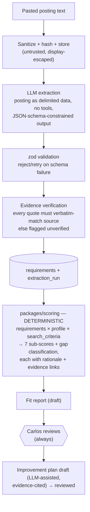

# CareerForge — Architecture

**Status:** Draft for review · **Last updated:** 2026-07-12

Companion to [PLAN.md](./PLAN.md). Decisions referenced here are justified in [DECISIONS/](./DECISIONS/).

---

## 1. System Overview

CareerForge is a **modular monolith**: one deployable API, one platform UI, one statically generated portfolio site, and shared packages with enforced boundaries. No microservices — a single senior engineer, a single user, and a local-first deployment make distributed complexity indefensible (see ADR-0004 for the tooling corollary; the monolith itself is a hard project constraint).


Trust boundaries:

- **Job-posting text is untrusted input** everywhere: sanitized before display, never interpolated into system prompts, always passed to the LLM as delimited data (ADR-0006).
- **LLM output is untrusted** until zod-validated and its evidence quotes are verbatim-verified against the source.
- **The public repo is a trust boundary**: real career data lives only in gitignored `docs/profile/` and the local database (ADR-0007).

## 2. Monorepo Layout

pnpm workspaces (ADR-0004):

```
careerforge/
├── apps/
│   ├── api/            # Fastify. routes → services → repositories. No SQL in routes.
│   ├── web/            # Nuxt platform UI (job engine + accelerator). Talks only to apps/api.
│   └── portfolio/      # Nuxt SSG portfolio. No runtime backend. Deployed from CI.
├── packages/
│   ├── core/           # Domain types, zod schemas, shared constants. Depends on nothing internal.
│   ├── db/             # Drizzle schema, migrations, repository implementations.
│   ├── llm/            # LlmProvider interface, Anthropic adapter, versioned prompts, injection guards.
│   ├── scoring/        # Deterministic fit-scoring + gap-classification engine. Pure functions.
│   └── config/         # Shared tsconfig, eslint config.
├── docs/
│   ├── profile/        # REAL career data — gitignored, local only
│   ├── profile.example/# Sanitized fictional profile — committed, used by tests/demos
│   ├── DECISIONS/      # ADRs
│   └── *.md            # PLAN, ARCHITECTURE, BACKLOG, RISKS, OPEN-QUESTIONS
├── docker-compose.yml  # Postgres 16
└── .github/workflows/  # CI: typecheck, lint, test, portfolio build + Lighthouse/axe/link gates
```

### Module boundary rules (enforced by review + lint rules where practical)

| Rule | Why |
| --- | --- |
| `packages/scoring` never imports `packages/llm` | Deterministic logic and model output must stay separable and independently testable (hard constraint) |
| `packages/llm` is the only module that talks to LLM providers | Single choke point for injection defense, prompt versioning, cost tracking, provider swap |
| Only `packages/db` contains SQL/Drizzle queries | Repository layering; routes and services stay storage-agnostic |
| `packages/core` has zero internal dependencies | It defines the shared language (types + zod schemas) everything else validates against |
| `apps/portfolio` never imports platform packages | The portfolio must build and deploy with zero access to private data or the API |
| Posting-derived text never enters a system prompt, anywhere | Prompt-injection defense (ADR-0006) |

**Portfolio deploy path (M2-01, 2026-07-19):** `apps/portfolio` is a Nuxt SSG site deployed to **GitHub Pages** from CI on merge to `main` (`.github/workflows/deploy.yml`; ADR-0008). Zero user-defined secrets — it publishes via the auto `GITHUB_TOKEN` + OIDC. The `ANY_INTERNAL` eslint wall (`packages/config/eslint.config.js`, `apps/portfolio/**`) enforces the boundary rule above: the portfolio imports no `@careerforge/*` package except `@careerforge/config`. The site serves from the apex root `/` (custom domain `carlosgutz.com`; ADR-0008 amended 2026-07-20, M2-11); the deploy build is plain `generate` — the same script the CI `portfolio-build` check invokes, so tested and deployed output cannot drift. Content is repo-authored and trusted; nothing from `docs/profile/` ever enters this app. Case studies live in a dedicated `caseStudies` content collection (`content/case-studies/*.md`) whose honesty schema — seven fixed sections, a required provenance label (professional / personal / personal, AI-assisted), and results sourced to a resolvable citation — is enforced by a deterministic build-time gate (`scripts/validate-case-studies.mjs`, run in `portfolio-build`; ADR-0010), because `@nuxt/content` performs no validation at ingest. M2-05 published the first studies (Heartland ×3) and M2-06 added two more (Love's + Nintendo), and M2-07 added Binventory + CareerForge (both `personal_ai_assisted`), seven in all, linked from the home page; Nitro prerenders each `/case-studies/<slug>/` from that crawl, and the quality gates (Lighthouse budgets, full axe, internal link/asset check) plus a provenance-label assertion (`scripts/assert-provenance.mjs`) now cover every case-study page as well as `/`. The professional studies' profile-derived, sensitivity-reviewed tokens cross the privacy boundary via the privacy-check publication allowlist (ADR-0011); CareerForge, published from its private staging draft, is instead handled by excluding that draft from privacy-check's structural extractors (ADR-0011 M2-07 amendment); sensitive classes stay fully detected.

## 3. Core Data Model

All tables carry `user_id` (single user today; multi-user is a migration, not a redesign — ADR-0007). Timestamps (`created_at`, `updated_at`) omitted below for brevity.

```mermaid
erDiagram
    users ||--o{ sessions : "authenticates via"
    users ||--o{ profile_skills : has
    users ||--o{ profile_experiences : has
    users ||--o{ profile_projects : has
    users ||--|| search_criteria : has
    users ||--o{ job_postings : ingests

    profile_experiences ||--o{ profile_projects : includes

    job_postings ||--o{ extraction_runs : "analyzed by"
    extraction_runs ||--o{ requirements : produces
    job_postings ||--o{ fit_reports : "scored in"
    fit_reports ||--o{ fit_sub_scores : "composed of"
    fit_sub_scores ||--o{ evidence_links : cites
    requirements ||--o{ evidence_links : "supported by"
    requirements ||--o{ gaps : "may become"
    fit_reports ||--o{ gaps : summarizes
    job_postings ||--o| applications : "tracked as"
    applications ||--o{ application_events : logs
    fit_reports ||--o| improvement_plans : "drafted from"
    fit_reports ||--o{ improvement_plan_runs : "drafting audited by"
    improvement_plans ||--o{ plan_items : contains
    gaps ||--o{ plan_items : "cited by"

    gaps }o--o{ learning_plans : "addressed by"
    learning_plans ||--o{ exercises : contains
    exercises ||--o{ mastery_evidence : "proven by"
    exercises ||--o| case_studies : "may become"
    profile_projects ||--o| case_studies : "may become"

    users {
        uuid id PK
        text email
        text password_hash
    }
    sessions {
        uuid id PK
        uuid user_id FK
        text token_hash "sha-256; raw token only in the cookie"
        timestamptz expires_at
    }
    profile_skills {
        uuid id PK
        uuid user_id FK
        text name
        text category
        text level "expert | solid | rusty | learning"
        int years
        date last_used
    }
    profile_experiences {
        uuid id PK
        uuid user_id FK
        text company
        text title
        date start_date
        date end_date
    }
    profile_projects {
        uuid id PK
        uuid user_id FK
        uuid experience_id FK "nullable — personal projects"
        text name
        text provenance "professional | personal | personal_ai_assisted"
        text summary
    }
    search_criteria {
        uuid id PK
        uuid user_id FK
        jsonb hard_filters "from job-criteria.md exclude_when"
        jsonb positive_signals
        jsonb negative_signals
        jsonb force_lowest_priority "cap to bottom tier, never exclusion (M1-08)"
        jsonb comp_bounds
    }
    job_postings {
        uuid id PK
        uuid user_id FK
        text raw_text "UNTRUSTED"
        text content_hash "dedupe"
        text company
        text title
        text source_note "where Carlos found it"
        text status "new | extracted | scored | archived"
    }
    extraction_runs {
        uuid id PK
        uuid user_id FK
        uuid posting_id FK
        text provider
        text model
        text prompt_id "e.g. extract-requirements@v2"
        jsonb raw_response "audit / replay (verbatim modulo NUL strip)"
        int input_tokens
        int output_tokens
        int cache_read_input_tokens
        int cache_creation_input_tokens
        int latency_ms
        int attempt "1, or 2 on the schema-failure retry"
        text status "ok | schema_failed | refusal | max_tokens | error | flagged"
    }
    requirements {
        uuid id PK
        uuid user_id FK
        uuid extraction_run_id FK
        text kind "must_have | nice_to_have"
        text category "language | framework | domain | seniority | comp | location | other"
        text text
        text source_quote "verbatim from posting"
        bool quote_verified "set inline at persist since M1-06; NULL only on pre-M1-06 rows until backfilled"
        real confidence
        int position "model output order, most significant first"
    }
    fit_reports {
        uuid id PK
        uuid user_id FK "ADR-0007 (M1-09)"
        uuid posting_id FK
        uuid extraction_run_id FK
        text verdict "scored | excluded — the explicit exclusion verdict at rest (M1-09)"
        jsonb exclusions "fired hard filters w/ quote evidence; empty iff scored"
        jsonb criteria_snapshot "exact criteria object scored (A1) — reports stay self-explaining after criteria edits"
        jsonb forced_lowest "force-lowest outcome at scoring time (A2; flag, never a score clamp)"
        bool input_flagged "the scored run was flagged (M1-06) — UI prominence"
        text review_status "draft | reviewed"
        text notes
    }
    fit_sub_scores {
        uuid id PK
        uuid user_id FK "ADR-0007 (M1-09)"
        uuid fit_report_id FK
        text dimension "min_quals | technical | domain | seniority | comp_location | priority | stretch; UNIQUE (report, dimension)"
        real score "0..1 (CHECK)"
        text rationale "deterministic, rule-generated"
    }
    evidence_links {
        uuid id PK
        uuid user_id FK "ADR-0007 (M1-09)"
        uuid fit_sub_score_id FK "report-side anchor (M1-09) — re-scoring never mingles evidence"
        uuid requirement_id FK
        uuid profile_skill_id FK "nullable, SET NULL"
        uuid profile_project_id FK "nullable, SET NULL"
        uuid profile_experience_id FK "nullable, SET NULL — adjacent evidence can be experience-derived (M1-09 D9)"
        text posting_quote
        text profile_quote
        text strength "direct | partial | adjacent"
    }
    gaps {
        uuid id PK
        uuid user_id FK "ADR-0007 (M1-11)"
        uuid fit_report_id FK "report-side anchor (M1-11) — re-scoring never mingles gap sets"
        uuid requirement_id FK
        text classification "have | have_undemonstrated | needs_refresh | genuine_gap | low_priority; EFFECTIVE value (engine or override); UNIQUE (report, requirement)"
        text engine_classification "the engine's fresh assignment, immutable (M1-11) — divergence from classification is the visible override-drift signal"
        text rationale "deterministic, rule-generated"
        bool user_overridden
        text override_note "nullable — an override records its why"
        text carried_via "requirement_id | content | NULL — how a carried override arrived (M1-11 A1)"
    }
    applications {
        uuid id PK
        uuid user_id FK
        uuid posting_id FK
        text stage "considering | applied | screen | interview | offer | rejected | withdrawn"
        date applied_on
    }
    application_events {
        uuid id PK
        uuid user_id FK
        uuid application_id FK
        text kind "stage_change | note | outcome"
        text detail
        date occurred_on
    }
    improvement_plan_runs {
        uuid id PK
        uuid user_id FK
        uuid fit_report_id FK
        text provider
        text model
        text prompt_id "e.g. improvement-plan@v1"
        jsonb raw_response "audit / replay (verbatim modulo NUL strip); embeds profile-derived text"
        int input_tokens
        int output_tokens
        int cache_read_input_tokens
        int cache_creation_input_tokens
        int latency_ms
        int attempt "1, or 2 on the schema-failure retry"
        text status "ok | schema_failed | refusal | max_tokens | error | flagged"
    }
    improvement_plans {
        uuid id PK
        uuid user_id FK
        uuid fit_report_id FK "UNIQUE - at most one plan per report"
        uuid drafting_run_id FK "the ok wire call this plan was parsed from"
        text review_status "draft | reviewed"
        text notes "nullable; captured by the one-shot review"
    }
    plan_items {
        uuid id PK
        uuid user_id FK
        uuid improvement_plan_id FK
        uuid gap_id FK "the citation - structural, never prose-parsed"
        text action "LLM-drafted; immutable"
        text priority "high | medium | low"
        text status "planned | in_progress | complete | dropped"
        int position "model output order"
    }
    learning_plans {
        uuid id PK
        uuid user_id FK
        text title
        text review_status "draft | reviewed"
    }
    exercises {
        uuid id PK
        uuid learning_plan_id FK
        text title
        text kind "kata | project | writeup | interview_drill"
        text status "planned | in_progress | complete"
    }
    mastery_evidence {
        uuid id PK
        uuid exercise_id FK
        text kind "implemented | tested | explained | revisited"
        text artifact_url
        date recorded_on
    }
    case_studies {
        uuid id PK
        uuid user_id FK
        uuid exercise_id FK "nullable"
        uuid profile_project_id FK "nullable"
        text title
        text provenance "professional | personal | personal_ai_assisted"
        text status "draft | published"
    }
```



Notes:

- **`gaps` ↔ `learning_plans` is many-to-many** via a `learning_plan_gaps` join table (elided in the diagram for readability).
- **Extraction is append-only**: re-running extraction creates a new `extraction_run`; old runs, raw responses, and prompt IDs are kept for audit and prompt-regression comparison.
- **The flywheel in data:** `application_events` outcomes → suggested weight adjustments on `search_criteria` (human-reviewed, M4) · completed `exercises` → `case_studies` drafts · `mastery_evidence` → `profile_skills.level` upgrades.
- **Schema v1 amendments (M0-06, ratified 2026-07-13):** `sessions` added (absent from the original ERD; minimal M0-07-compatible shape). `user_id` added to `applications` and `application_events` — ADR-0007's "every table carries user_id" wins over the original diagram, which reached users only via `posting_id`. Enum-like columns are `text` + CHECK constraints derived from `packages/core` value sets (native pg enums rejected: `ALTER TYPE` fights forward-only migrations, ADR-0003). `applications.posting_id` is `ON DELETE RESTRICT` on purpose: postings with an application are archived (`status = 'archived'`), never deleted.
- **ERD addendum (M1-04, 2026-07-15 — `extraction_runs` still unbuilt; the table arrives with M1-05's migration):** the diagram now matches the M1-04 runner's `LlmCallRecord`, which is what M1-05's persistence sink will receive. Added columns: `input_tokens`, `output_tokens`, `cache_read_input_tokens`, `cache_creation_input_tokens` (the per-run usage this document already promised in "token usage recorded per run"), `latency_ms`, and `attempt`. The `status` vocabulary is reconciled with the runner's typed outcomes: `ok | schema_failed | refusal | max_tokens | error` are set by the runner (refusal and max_tokens are NOT schema failures — a refusal is a content outcome, and max_tokens truncation is a prompt-config bug distinguished via stop_reason); `flagged` is applied post-hoc by evidence verification (M1-06) and never set by the runner.
- **ERD addendum (M1-05, 2026-07-16 — the tables are BUILT, migration 0003):** four deltas from the diagram as previously drawn, all now reflected above. (1) `user_id` on both tables — ADR-0007's "every table carries user_id" wins again (the applications precedent). (2) `requirements.position` — model output order (the prompt orders most-significant-first); rows have no inherent order and reads sort by it. (3) `quote_verified` is **nullable**: NULL = not yet verified; M1-06 sets true/false. (4) `extraction_runs.created_at` is written from the runner's clock (`LlmCallRecord.timestamp`, the now seam — external review F3), and `raw_response` is stored verbatim **modulo stripping real U+0000 CHARACTERS from string values and object keys** (Postgres jsonb rejects the character anywhere; losing the audit row is worse; the literal escape TEXT backslash-u-0000 survives byte-identical — external review R1). FK behavior: `posting_id` **cascades** (unlike `applications.posting_id`) because `raw_response` embeds posting text — a posting deletion must not strand its text in audit rows; deletion is not a feature today, this pins the privacy-coherent behavior if it becomes one.
- **ERD addendum (M1-06, 2026-07-17 — evidence verification built):** `quote_verified` is set **inline at persist** for every new extraction (the service computes deterministic whitespace-normalized verdicts via core's `verifyQuotes`; `persistExtraction` derives the final run's status AT INSERT TIME through the single policy site `deriveRunStatus` — `flagged` iff any verdict is false); pre-M1-06 NULL rows are covered by the idempotent `pnpm extraction:verify-quotes` backfill CLI (per-run transactions, counts/ids-only output). The **requirement-bearing** status set (`ok | flagged`, `REQUIREMENT_BEARING_STATUSES` in core) now keys the extract cache read, the GET requirements path, the posting flip, and the unarchive law — a flagged run stays served and its posting counts as extracted (flags mean human review, not absence). Column stays nullable by decision: a SET NOT NULL migration would demand backfill-before-migrate ordering on any env with data, for zero behavioral gain.

- **ERD addendum (M1-11, 2026-07-18 — gap classification built, migration 0006):** the `gaps` table lands per the amended shape above. Deltas from the original diagram, each ratified at the plan gate: (1) `user_id` — ADR-0007's "every table carries user_id" wins again (the fit-tables precedent). (2) `engine_classification` — the engine's fresh assignment is stored beside the effective `classification`, immutable, so an override that the engine now disagrees with is structurally visible, never prose-parsed. (3) `override_note` (nullable) — an override records its why; replaced wholesale on every PATCH (full-replacement semantics, no merge-patch). (4) `carried_via` (nullable, CHECK `requirement_id | content`) — the carry audit: how an override arrived on a re-score's row; NULL = fresh assignment or direct user PATCH. (5) `UNIQUE (fit_report_id, requirement_id)` — one classification per requirement per report. (6) The `requirements ||--o| gaps` edge is corrected to `||--o{`: gap sets are PER-REPORT, append-only artifacts written in the same transaction as their fit report — one requirement maps to one gap per report, many across appended reports. Enum-like columns are text + CHECK from `packages/core` value sets (M0-06 convention). Override carry-forward consults ONLY the posting's immediately prior report (latest by created_at/id at persist time): requirement_id binds across re-scores; a one-to-one whitespace-normalized text match binds across re-extractions (ambiguity on either side never carries); everything unbound surfaces as a loud `lostOverrides` count derived at read time with the same rules — an un-override is final, and no override is ever silently dropped. Unscored requirement rows (`quote_verified` false/NULL) get NO gap row: classification never builds on unverified content (M1-06).

- **ERD addendum (M1-12, 2026-07-19 — improvement plans built, migration 0007):** the three tables land per the amended shape above. Deltas from the original diagram, each ratified at the plan gate: (1) `improvement_plan_runs` — an entire audit table the diagram did not draw: recording is law (ADR-0005 §2, RISKS T-03), and the drafting call's rows mirror `extraction_runs` column-for-column minus `posting_id` plus `fit_report_id`, one row per WIRE CALL (the M1-05 law at its second call site); the plan row is created only from an `ok` run — the `extraction_runs` ↔ `requirements` parallel. `raw_response` embeds profile- and gap-derived text: never logged, never on the wire. (2) `user_id` on all three tables — ADR-0007's "every table carries user_id" wins again (5th application). (3) `created_at`/`updated_at` on all three (never drawn, always applied); `improvement_plan_runs.created_at` is written from the runner's clock. (4) `improvement_plans.drafting_run_id` — the audit anchor to the ok wire call, and the GET's run-selection contract (the run served under a plan is the plan's OWN drafting run, never latest-by-time — a lost concurrent-draft race could otherwise put the wrong run under the telemetry). (5) `improvement_plans.notes` — review-note parity with `fit_reports.notes`. (6) `UNIQUE improvement_plans.fit_report_id` — the drawn `||--o|` enforced in the DB (the `applications.posting_id` precedent); the UNIQUE is also the cache: an existing plan is served with no LLM call, and the lost leg of a concurrent double-draft commits its audit rows via ON CONFLICT DO NOTHING instead of aborting (honest telemetry). (7) `plan_items.position` — model output order (the `requirements.position` precedent). (8) Vocabularies (text + CHECK from `packages/core` value sets, M0-06 convention): `priority high|medium|low` and `status planned|in_progress|complete|dropped` were NOT drawn and are invented here — `planned|in_progress|complete` deliberately matches the drawn `exercises.status` family so sibling artifact tables share one terminal vocabulary when M3-02 lands, and `dropped` is the honest "I won't do this"; the run `status` vocabulary reuses the runner's five states plus post-hoc `flagged`, which for drafting means CITATION-validation failure (the model cited a gap ref that was never sent — the ADR-0006 layer-4 analog; such a run persists `flagged` with NO plan row). (9) FK on-delete CASCADE throughout — the report's derived-artifact family. The `plan_items.gap_id` cascade is total because gap rows can vanish by TWO routes — `gaps.fit_report_id` → fit_reports, and `gaps.requirement_id` → requirements → extraction_runs — and `fit_reports` ALSO cascades from `extraction_run_id`, so every real deletion origin (posting or extraction_run) removes the report, and with it the plan through its own `fit_report_id` FK, in the same statement. The `gaps ||--o{ plan_items` edge above makes the block's already-declared `gap_id` FK explicit (many items may cite one gap). PLAN-ITEM IDENTITY (the M1-09-R1 → M1-11-A1 lineage, decided at the gate): PIN-TO-REPORT — a plan is an append-only artifact of exactly ONE report; a re-score creates a new report with no plan until one is explicitly drafted (drafting is gated on a REVIEWED report, per §4's pipeline order); prior plans stay anchored to their reports, never mutated, never carried. Two named residuals ride the M1-13 friction log: a superseded plan (and its item progress) leaves the latest-report UI after a re-score, and a gap override landed AFTER drafting leaves items citing draft-time classifications beside the live value — visible but unexplained until a re-score.

## 4. The Two-Stage Analysis Pipeline

The central design rule (ADR-0005/0006): **the LLM extracts, deterministic code scores.**



Why this split matters: scores are **reproducible and explainable** (same inputs → same sub-scores; every number traceable to a rule and a quote), the LLM's blast radius is limited to extraction quality (which the evidence-verification step audits), and prompt-injection payloads can at worst corrupt one extraction run — which flags rather than propagates (ADR-0006).

## 5. API Surface Sketch

Fastify with zod type-provider; OpenAPI generated from route schemas and served at `/docs` in dev (M0-09: the interactive UI registers only outside production, and its routes are the only auth-guard exemptions beyond `/health` and `/auth/login` — marked public by a scoped hook in `apps/api/src/routes/docs.ts`). The spec is committed at `docs/api/openapi.json` (`pnpm openapi:generate`) and drift-checked by a vitest test inside `pnpm test`, so a route-schema change without a regenerated spec fails CI's required `test` check. The generator runs a dev-mode build, but the swagger-ui routes are marked `schema: { hide: true }` and @fastify/swagger excludes hidden routes — /docs is the only env-dependent surface, so the committed spec is also exactly the production API surface by construction. All routes except `/auth/login` and `/health` require a session. Mutating LLM operations are explicit POST verbs — nothing runs implicitly.

| Area | Endpoints (sketch) |
| --- | --- |
| System | `GET /health` |
| Auth | `POST /auth/login` · `POST /auth/logout` · `GET /auth/me` |
| Profile | `GET/PUT /profile` · `GET/POST/PATCH /profile/skills` · `/profile/experiences` · `/profile/projects` · `POST /profile/import` (re-parse `docs/profile/`) |
| Criteria | `GET/PUT /criteria` (structured search criteria) |
| Postings | `POST /postings` (paste) · `GET /postings` · `GET /postings/:id` · `POST /postings/:id/extract` · `GET /postings/:id/requirements` · `PATCH /postings/:id` (status) |
| Fit | `POST /postings/:id/fit` (run deterministic scoring; always scores fresh and appends) · `GET /postings/:id/fit` (latest report or `report: null`) · `POST /fit-reports/:id/review` (one-shot draft→reviewed with notes; delivered as a CAS-event POST rather than the PATCH originally sketched here — M1-10, recorded deviation) |
| Gaps | `GET /fit-reports/:id/gaps` · `PATCH /gaps/:id` (override classification) |
| Plans | `POST /fit-reports/:id/improvement-plan` (LLM drafting; requires a reviewed report; one plan per report — an existing plan serves 200 with no call) · `GET /fit-reports/:id/improvement-plan` (plan-or-null, report-scoped like the gaps read — recorded deviation from the `GET /improvement-plans/:id` originally sketched here, M1-12) · `POST /improvement-plans/:id/review` (one-shot draft→reviewed; CAS-event POST rather than the PATCH originally sketched — the M1-10 deviation's second application, M1-12) · `PATCH /plan-items/:id` (status + priority only; action/gap/position immutable) |
| Applications | `POST/GET /applications` · `GET /applications/:id` · `PATCH /applications/:id` · `POST /applications/:id/events` |
| Accelerator | `POST /learning-plans` (from gap ids) · `GET/PATCH /learning-plans/:id` · `POST/PATCH /exercises` · `POST /exercises/:id/evidence` · `GET /review-queue` (spaced revisits) · `POST /postings/:id/interview-prep` |
| Case studies | `POST /case-studies` (incl. draft-from-exercise) · `GET/PATCH /case-studies/:id` |

Ranking consumption contract (M1-10): no ranked posting list exists yet; `forced_lowest` is consumed at presentation (policy chip + cap marker beside the honest priority number). Any FUTURE ranked list MUST sort forced-lowest reports into the bottom tier regardless of scores — a cap, never a clamp and never an exclusion.

Conventions: JSON only; zod validation on every input; structured error shape `{ error: { code, message } }`; pino request logging with request IDs; no PII in logs.

## 6. Cross-Cutting Concerns

- **Validation:** zod at every boundary — API input, LLM output, env vars (fail fast at boot), profile import.
- **Logging:** pino structured JSON, request-scoped IDs, LLM calls logged with prompt ID + token usage + latency, never with full posting text or profile PII.
- **Testing:** Vitest unit tests everywhere; integration tests against dockerized Postgres for repositories and routes; `packages/scoring` gets exhaustive table-driven tests (it's pure); injection-payload suite in `packages/llm` runs in CI with a mocked provider (deterministic) plus an optional live smoke test.
- **Migrations:** Drizzle-kit generated SQL, checked in, forward-only, run via `pnpm db:migrate`.
- **CI (GitHub Actions):** typecheck + lint + test on every PR; portfolio build gated by Lighthouse budgets, full axe-core, and an internal link/asset check on `/` and every case-study page (ADR-0009, extended M2-05) plus a case-study content gate and a provenance-label assertion (ADR-0010); gitleaks secret scan. Main is always releasable.
- **Config/secrets:** `.env` local only, `.env.example` documents every variable, zod-validated at boot. The only secret in the MVP is the LLM API key (+ session secret).
- **LLM cost control:** extraction results cached by `content_hash × prompt_id`; re-extraction is an explicit user action; token usage recorded per run.

## 7. What We Are Deliberately Not Building

- Microservices, queues, or background workers — nothing here needs them yet; a synchronous request with a spinner is honest for a single user. If extraction latency hurts, the first step is an in-process job table, not infrastructure.
- Multi-tenancy, RBAC, teams — schema keeps the door open; product does not walk through it.
- Scraping/automated ingestion — excluded from MVP by constraint; future work gated by the legal invariants in RISKS.md.
- A design system framework for the platform UI — the *portfolio* gets the craft budget; the platform UI stays clean but utilitarian.
