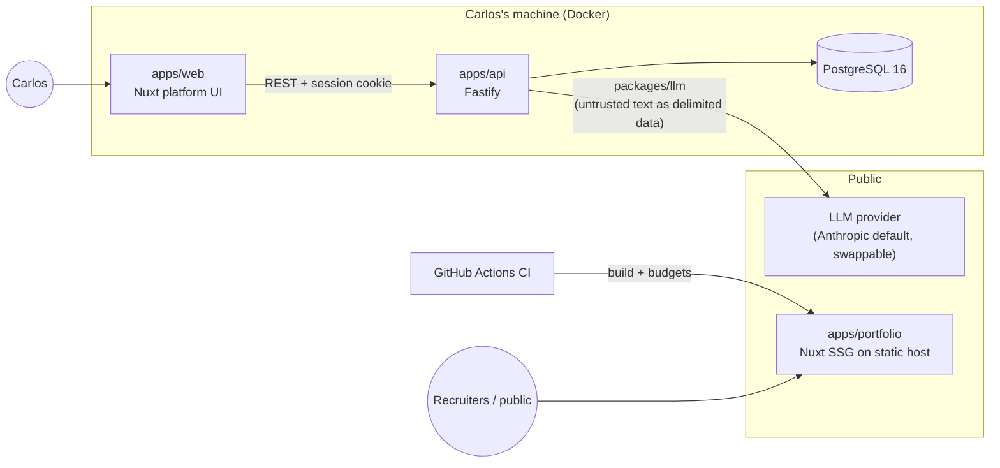
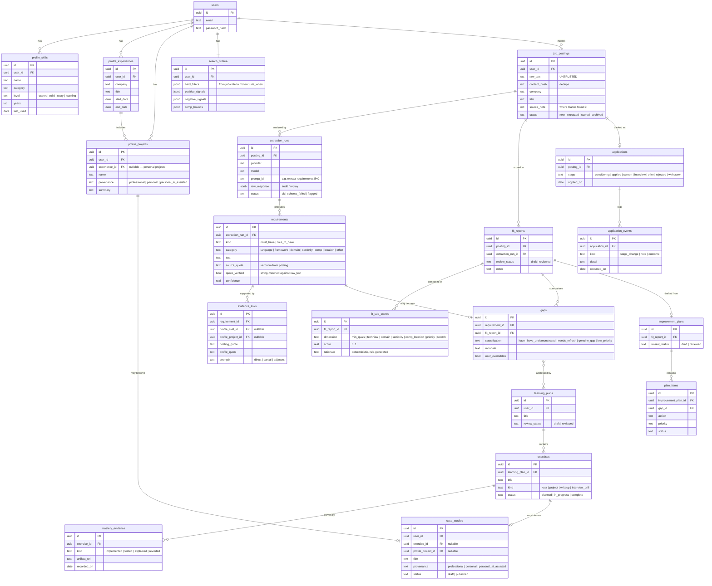
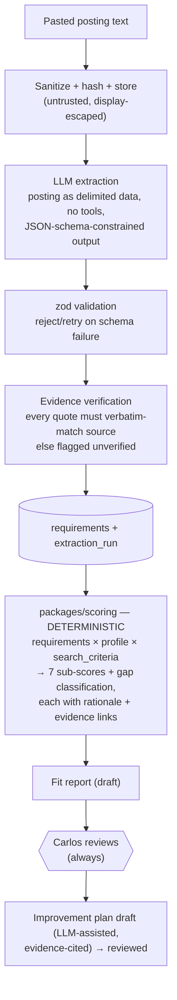

# CareerForge — Architecture

**Status:** Draft for review · **Last updated:** 2026-07-12

Companion to [PLAN.md](./PLAN.md). Decisions referenced here are justified in [DECISIONS/](./DECISIONS/).

---

## 1. System Overview

CareerForge is a **modular monolith**: one deployable API, one platform UI, one statically generated portfolio site, and shared packages with enforced boundaries. No microservices — a single senior engineer, a single user, and a local-first deployment make distributed complexity indefensible (see ADR-0004 for the tooling corollary; the monolith itself is a hard project constraint).



Trust boundaries:

- **Job-posting text is untrusted input** everywhere: sanitized before display, never interpolated into system prompts, always passed to the LLM as delimited data (ADR-0006).
- **LLM output is untrusted** until zod-validated and its evidence quotes are verbatim-verified against the source.
- **The public repo is a trust boundary**: real career data lives only in gitignored `docs/profile/` and the local database (ADR-0007).

## 2. Monorepo Layout

pnpm workspaces (ADR-0004):

```
careerforge/
├── apps/
│   ├── api/            # Fastify. routes → services → repositories. No SQL in routes.
│   ├── web/            # Nuxt platform UI (job engine + accelerator). Talks only to apps/api.
│   └── portfolio/      # Nuxt SSG portfolio. No runtime backend. Deployed from CI.
├── packages/
│   ├── core/           # Domain types, zod schemas, shared constants. Depends on nothing internal.
│   ├── db/             # Drizzle schema, migrations, repository implementations.
│   ├── llm/            # LlmProvider interface, Anthropic adapter, versioned prompts, injection guards.
│   ├── scoring/        # Deterministic fit-scoring + gap-classification engine. Pure functions.
│   └── config/         # Shared tsconfig, eslint config.
├── docs/
│   ├── profile/        # REAL career data — gitignored, local only
│   ├── profile.example/# Sanitized fictional profile — committed, used by tests/demos
│   ├── DECISIONS/      # ADRs
│   └── *.md            # PLAN, ARCHITECTURE, BACKLOG, RISKS, OPEN-QUESTIONS
├── docker-compose.yml  # Postgres 16
└── .github/workflows/  # CI: typecheck, lint, test, portfolio build + budgets
```

### Module boundary rules (enforced by review + lint rules where practical)

| Rule | Why |
| --- | --- |
| `packages/scoring` never imports `packages/llm` | Deterministic logic and model output must stay separable and independently testable (hard constraint) |
| `packages/llm` is the only module that talks to LLM providers | Single choke point for injection defense, prompt versioning, cost tracking, provider swap |
| Only `packages/db` contains SQL/Drizzle queries | Repository layering; routes and services stay storage-agnostic |
| `packages/core` has zero internal dependencies | It defines the shared language (types + zod schemas) everything else validates against |
| `apps/portfolio` never imports platform packages | The portfolio must build and deploy with zero access to private data or the API |
| Posting-derived text never enters a system prompt, anywhere | Prompt-injection defense (ADR-0006) |

## 3. Core Data Model

All tables carry `user_id` (single user today; multi-user is a migration, not a redesign — ADR-0007). Timestamps (`created_at`, `updated_at`) omitted below for brevity.



Notes:

- **`gaps` ↔ `learning_plans` is many-to-many** via a `learning_plan_gaps` join table (elided in the diagram for readability).
- **Extraction is append-only**: re-running extraction creates a new `extraction_run`; old runs, raw responses, and prompt IDs are kept for audit and prompt-regression comparison.
- **The flywheel in data:** `application_events` outcomes → suggested weight adjustments on `search_criteria` (human-reviewed, M4) · completed `exercises` → `case_studies` drafts · `mastery_evidence` → `profile_skills.level` upgrades.

## 4. The Two-Stage Analysis Pipeline

The central design rule (ADR-0005/0006): **the LLM extracts, deterministic code scores.**



Why this split matters: scores are **reproducible and explainable** (same inputs → same sub-scores; every number traceable to a rule and a quote), the LLM's blast radius is limited to extraction quality (which the evidence-verification step audits), and prompt-injection payloads can at worst corrupt one extraction run — which flags rather than propagates (ADR-0006).

## 5. API Surface Sketch

Fastify with zod type-provider; OpenAPI generated from route schemas and served at `/docs` in dev. All routes except `/auth/login` and `/health` require a session. Mutating LLM operations are explicit POST verbs — nothing runs implicitly.

| Area | Endpoints (sketch) |
| --- | --- |
| System | `GET /health` |
| Auth | `POST /auth/login` · `POST /auth/logout` · `GET /auth/me` |
| Profile | `GET/PUT /profile` · `GET/POST/PATCH /profile/skills` · `/profile/experiences` · `/profile/projects` · `POST /profile/import` (re-parse `docs/profile/`) |
| Criteria | `GET/PUT /criteria` (structured search criteria) |
| Postings | `POST /postings` (paste) · `GET /postings` · `GET /postings/:id` · `POST /postings/:id/extract` · `GET /postings/:id/requirements` · `PATCH /postings/:id` (status) |
| Fit | `POST /postings/:id/fit` (run deterministic scoring) · `GET /postings/:id/fit` · `PATCH /fit-reports/:id` (review) |
| Gaps | `GET /fit-reports/:id/gaps` · `PATCH /gaps/:id` (override classification) |
| Plans | `POST /fit-reports/:id/improvement-plan` · `GET/PATCH /improvement-plans/:id` · `PATCH /plan-items/:id` |
| Applications | `POST/GET /applications` · `PATCH /applications/:id` · `POST /applications/:id/events` |
| Accelerator | `POST /learning-plans` (from gap ids) · `GET/PATCH /learning-plans/:id` · `POST/PATCH /exercises` · `POST /exercises/:id/evidence` · `GET /review-queue` (spaced revisits) · `POST /postings/:id/interview-prep` |
| Case studies | `POST /case-studies` (incl. draft-from-exercise) · `GET/PATCH /case-studies/:id` |

Conventions: JSON only; zod validation on every input; structured error shape `{ error: { code, message } }`; pino request logging with request IDs; no PII in logs.

## 6. Cross-Cutting Concerns

- **Validation:** zod at every boundary — API input, LLM output, env vars (fail fast at boot), profile import.
- **Logging:** pino structured JSON, request-scoped IDs, LLM calls logged with prompt ID + token usage + latency, never with full posting text or profile PII.
- **Testing:** Vitest unit tests everywhere; integration tests against dockerized Postgres for repositories and routes; `packages/scoring` gets exhaustive table-driven tests (it's pure); injection-payload suite in `packages/llm` runs in CI with a mocked provider (deterministic) plus an optional live smoke test.
- **Migrations:** Drizzle-kit generated SQL, checked in, forward-only, run via `pnpm db:migrate`.
- **CI (GitHub Actions):** typecheck + lint + test on every PR; portfolio build with Lighthouse and axe budgets; gitleaks secret scan. Main is always releasable.
- **Config/secrets:** `.env` local only, `.env.example` documents every variable, zod-validated at boot. The only secret in the MVP is the LLM API key (+ session secret).
- **LLM cost control:** extraction results cached by `content_hash × prompt_id`; re-extraction is an explicit user action; token usage recorded per run.

## 7. What We Are Deliberately Not Building

- Microservices, queues, or background workers — nothing here needs them yet; a synchronous request with a spinner is honest for a single user. If extraction latency hurts, the first step is an in-process job table, not infrastructure.
- Multi-tenancy, RBAC, teams — schema keeps the door open; product does not walk through it.
- Scraping/automated ingestion — excluded from MVP by constraint; future work gated by the legal invariants in RISKS.md.
- A design system framework for the platform UI — the *portfolio* gets the craft budget; the platform UI stays clean but utilitarian.
