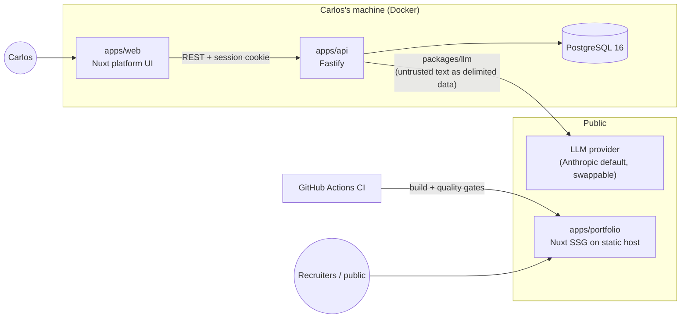
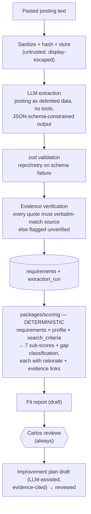

# CareerForge — Architecture

**Status:** Current — v1 shipped, 12-week roadmap complete · **Last updated:** 2026-07-26

Companion to [PLAN.md](./PLAN.md). Decisions referenced here are justified in [DECISIONS/](./DECISIONS/).

---

## 1. System Overview

CareerForge is a **modular monolith**: one deployable API, one platform UI, one statically generated portfolio site, and shared packages with enforced boundaries. No microservices — a single senior engineer, a single user, and a local-first deployment make distributed complexity indefensible (see ADR-0004 for the tooling corollary; the monolith itself is a hard project constraint). Local-first is a ratified decision, not just a premise — ADR-0015 defers public platform deployment (the platform holds real private career data) with named triggers for reopening.

**Demo deployment shape (M10-02):** the M10 arc packages the platform as a single **same-origin container** — `apps/api` serves both the JSON API and the platform SPA from one origin, so there is no separate web tier. The SPA is produced by `nuxt generate` (a static `.output/public` payload, no Nitro server) with `NUXT_PUBLIC_API_BASE=''` baked at generate time, and `apps/api` serves it via `@fastify/static` behind the optional `WEB_DIST_DIR` env var; when `WEB_DIST_DIR` is unset (dev/test/CI) the API is unchanged and web-serving is off. Browser navigations (`Accept: text/html`) are served the SPA shell so deep links resolve, while API calls fall through byte-for-byte — an Accept-aware pre-guard short-circuit, GET/HEAD and shell-bytes only, that leaves the auth guard, CSRF origin check, and cookie flags untouched (M10-01 probe + M10-02). The container migrates then boots as a non-root process and structurally excludes `docs/`, `.env*`, and the Nitro server output; it is a packaging shape only — a public demo instance is still gated on the demo-mode and deployment stories (M10-03..06) and the ADR-0015 triggers. **Deployment stack (M10-06):** the demo runs on **AWS ECS Fargate** (one 0.25 vCPU / 0.5 GB task) fronted by an **API Gateway HTTP API over a VPC Link into Cloud Map** (no load balancer), backed by **Neon serverless Postgres**, with a nightly EventBridge reseed of a dedicated seed task definition, an AWS Budgets alert, and a GitHub-OIDC deploy role (consumed by M10-07). The whole stack is **Terraform in `infra/terraform/`** — validated in-repo (`terraform validate`), never applied by CI; the first apply is operator-attended per the STOP-and-ask ceremony in `docs/RUNBOOKS.md`. The two real secrets (`DATABASE_URL`, `AUTH_BOOTSTRAP_PASSWORD`) live only in SSM and are referenced by name, so no secret value ever enters Terraform or its state, and no `ANTHROPIC_API_KEY` exists in the cloud (ADR-0022 for the shape, ADR-0023 for the keyless demo semantics).

**Demo mode (M10-03):** `DEMO_MODE=1` turns a same-origin container into a public demo. It is **keyless and fail-closed** — the env layer refuses to boot if a live `ANTHROPIC_API_KEY` is also set (a demo never calls the provider), and `main.ts` refuses to boot if no `demo_seed_state` marker exists (an unseeded demo never serves). The eight LLM-draft POSTs are marked `config:{ llmDraft: true }` and return **`DEMO_DISABLED` (403)** in demo mode (their outputs are pre-generated) — the marker set is a pinned gate, and the guard registers AFTER the auth guard so an unauthenticated call still gets 401 first. Mutating requests are throttled per client IP (login exempt). The demo's data is provisioned by two CLIs: **`demo:capture`** (operator-attended, live key, local scratch DB — drives the real pipeline over fictional postings + the example profile and exports a committed fixture set + manifest) and **`demo:seed`** (keyless — replays those fixtures into the bootstrap user, recomputing fit with the live deterministic engine at seed time and re-linking the captured artifacts to the recomputed graph by identity; idempotent, and it refuses at the DATA level if the target user has rows but no marker, so it can never clobber a real instance). `/health` gains a `demo` boolean so a client can tell a demo instance from a real one. **Web affordances (M10-04):** `apps/web` boot-fetches `/health` (fail-quiet — the server still enforces policy) and, on a demo instance, renders a persistent honest banner, prefills the canonical published demo credentials on the login page (`demo@careerforge.example`, RFC-reserved TLD — publication is the design, not a leak), and disables the eight draft triggers with an inline note (belt: a `DEMO_DISABLED` 403 maps to the same honest copy). The instance is kept out of search indexes at runtime via the demo-only `GET /robots.txt` + `X-Robots-Tag` header above (a deliberate mechanism deviation from the AC's "demo build only" — build-time env is inert per the M10-01 probe chain, and the container serves the SPA same-origin from this API, so the API is the one surface that sees every response; ADR-0023 records this).


```mermaid
flowchart LR
    subgraph Local["Carlos's machine (Docker)"]
        WEB["apps/web<br/>Nuxt platform UI"]
        API["apps/api<br/>Fastify"]
        PG[("PostgreSQL 16")]
        WEB -->|"REST + session cookie"| API
        API --> PG
    end

    subgraph Cloud["Public"]
        PORT["apps/portfolio<br/>Nuxt SSG on static host"]
        LLMAPI["LLM provider<br/>(Anthropic default, swappable)"]
    end

    API -->|"packages/llm<br/>(untrusted text as delimited data)"| LLMAPI
    CI["GitHub Actions CI"] -->|"build + quality gates"| PORT
    CARLOS((Carlos)) --> WEB
    PUBLIC((Recruiters / public)) --> PORT
```

Trust boundaries:

- **Job-posting text is untrusted input** everywhere: sanitized before display, never interpolated into system prompts, always passed to the LLM as delimited data (ADR-0006).
- **LLM output is untrusted** until zod-validated and its evidence quotes are verbatim-verified against the source.
- **The public repo is a trust boundary**: real career data lives only in gitignored `docs/profile/` and the local database (ADR-0007).

## 2. Monorepo Layout

pnpm workspaces (ADR-0004):

```
careerforge/
├── apps/
│   ├── api/            # Fastify. routes → services → repositories. No SQL in routes.
│   ├── web/            # Nuxt platform UI (job engine + accelerator). Talks only to apps/api.
│   └── portfolio/      # Nuxt SSG portfolio. No runtime backend. Deployed from CI.
├── packages/
│   ├── core/           # Domain types, zod schemas, shared constants. Depends on nothing internal.
│   ├── db/             # Drizzle schema, migrations, repository implementations.
│   ├── llm/            # LlmProvider interface, Anthropic adapter, versioned prompts, injection guards.
│   ├── scoring/        # Deterministic fit-scoring + gap-classification engine. Pure functions.
│   └── config/         # Shared tsconfig, eslint config.
├── docs/
│   ├── profile/        # REAL career data — gitignored, local only
│   ├── profile.example/# Sanitized fictional profile — committed, used by tests/demos
│   ├── DECISIONS/      # ADRs
│   └── *.md            # PLAN, ARCHITECTURE, BACKLOG, RISKS, OPEN-QUESTIONS
├── docker-compose.yml  # Postgres 16
└── .github/workflows/  # CI: typecheck, lint, test, portfolio build + Lighthouse/axe/link gates
```

### Module boundary rules (enforced by review + lint rules where practical)

| Rule | Why |
| --- | --- |
| `packages/scoring` never imports `packages/llm` | Deterministic logic and model output must stay separable and independently testable (hard constraint) |
| `packages/llm` is the only module that talks to LLM providers | Single choke point for injection defense, prompt versioning, cost tracking, provider swap |
| Only `packages/db` contains SQL/Drizzle queries | Repository layering; routes and services stay storage-agnostic |
| `packages/core` has zero internal dependencies | It defines the shared language (types + zod schemas) everything else validates against |
| `apps/portfolio` never imports platform packages | The portfolio must build and deploy with zero access to private data or the API |
| Posting-derived text never enters a system prompt, anywhere | Prompt-injection defense (ADR-0006) |

**Portfolio deploy path (M2-01, 2026-07-19):** `apps/portfolio` is a Nuxt SSG site deployed to **GitHub Pages** from CI on merge to `main` (`.github/workflows/deploy.yml`; ADR-0008). Zero user-defined secrets — it publishes via the auto `GITHUB_TOKEN` + OIDC. The `ANY_INTERNAL` eslint wall (`packages/config/eslint.preset.js`, `apps/portfolio/**`) enforces the boundary rule above: the portfolio imports no `@careerforge/*` package except `@careerforge/config`. The site serves from the apex root `/` (custom domain `carlosgutz.com`; ADR-0008 amended 2026-07-20, M2-11); the deploy build is plain `generate` — the same script the CI `portfolio-build` check invokes, so tested and deployed output cannot drift. Content is repo-authored and trusted; nothing from `docs/profile/` ever enters this app. Case studies live in a dedicated `caseStudies` content collection (`content/case-studies/*.md`) whose honesty schema — seven fixed sections, a required provenance label (professional / personal / personal, AI-assisted), and results sourced to a resolvable citation — is enforced by a deterministic build-time gate (`scripts/validate-case-studies.mjs`, run in `portfolio-build`; ADR-0010), because `@nuxt/content` performs no validation at ingest. M2-05 published the first studies (Heartland ×3) and M2-06 added two more (Love's + Nintendo), and M2-07 added Binnie + CareerForge (both `personal_ai_assisted`), seven in all, linked from the home page; Nitro prerenders each `/case-studies/<slug>/` from that crawl, and the quality gates (Lighthouse budgets, full axe, internal link/asset check) plus a provenance-label assertion (`scripts/assert-provenance.mjs`) now cover every case-study page as well as `/`. The professional studies' profile-derived, sensitivity-reviewed tokens cross the privacy boundary via the privacy-check publication allowlist (ADR-0011); CareerForge, published from its private staging draft, is instead handled by excluding that draft from privacy-check's structural extractors (ADR-0011 M2-07 amendment); sensitive classes stay fully detected. **M2-08** added the top-level home, about, and resume pages (`content/{index,about,resume}.md` rendered by dedicated pages in the `pages` collection): a name-forward home, the Nintendo→Love's→Heartland arc, and a public-reviewed resume mirror (no phone or home address; contact via a publish-safe email alias plus the LinkedIn profile URL). The axe and prerender-structure gates were extended to `/about/` and `/resume/` (Lighthouse and the internal link check already reach them via the `index.html` pattern and the home crawl); the one deliberately-published LinkedIn URL is a narrow exact-string carve-out in privacy-check, every other URL still detected (ADR-0011 M2-08 amendment).

## 3. Core Data Model

All tables carry `user_id` (single user today; multi-user is a migration, not a redesign — ADR-0007). Timestamps (`created_at`, `updated_at`) omitted below for brevity.


```mermaid
erDiagram
    users ||--o{ sessions : "authenticates via"
    users ||--o{ profile_skills : has
    users ||--o{ profile_experiences : has
    users ||--o{ profile_projects : has
    users ||--o{ profile_experience_bullets : has
    users ||--|| profile_contact : has
    users ||--o{ profile_summaries : has
    users ||--o{ profile_education : has
    users ||--o{ profile_facts : declares
    users ||--|| search_criteria : has
    users ||--o{ job_postings : ingests
    users ||--o{ criteria_adjustments : "tunes via"

    profile_experiences ||--o{ profile_projects : includes
    profile_experiences ||--o{ profile_experience_bullets : "has bullets"

    job_postings ||--o{ extraction_runs : "analyzed by"
    extraction_runs ||--o{ requirements : produces
    job_postings ||--o{ fit_reports : "scored in"
    fit_reports ||--o{ fit_sub_scores : "composed of"
    fit_sub_scores ||--o{ evidence_links : cites
    requirements ||--o{ evidence_links : "supported by"
    requirements ||--o{ gaps : "may become"
    fit_reports ||--o{ gaps : summarizes
    job_postings ||--o| applications : "tracked as"
    applications ||--o{ application_events : logs
    fit_reports ||--o| improvement_plans : "drafted from"
    fit_reports ||--o{ improvement_plan_runs : "drafting audited by"
    improvement_plans ||--o{ plan_items : contains
    gaps ||--o{ plan_items : "cited by"
    fit_reports ||--o| resume_variants : "tailored from"
    fit_reports ||--o{ resume_variant_runs : "tailoring audited by"
    resume_variants ||--o{ resume_variant_entries : contains
    resume_variant_entries ||--o{ resume_variant_citations : cites
    gaps ||--o{ resume_variant_citations : "cited by"

    gaps }o--o{ learning_plans : "addressed by"
    learning_plans ||--o{ exercises : contains
    exercises ||--o{ mastery_evidence : "proven by"
    exercises ||--o| case_studies : "may become"
    profile_projects ||--o| case_studies : "may become"
    gaps ||--o{ demo_blueprints : "anchors (SET NULL)"

    users {
        uuid id PK
        text email
        text password_hash
    }
    sessions {
        uuid id PK
        uuid user_id FK
        text token_hash "sha-256; raw token only in the cookie"
        timestamptz expires_at
    }
    profile_skills {
        uuid id PK
        uuid user_id FK
        text name
        text category
        text level "expert | solid | rusty | learning"
        int years
        date last_used
    }
    profile_experiences {
        uuid id PK
        uuid user_id FK
        text company
        text title
        date start_date
        date end_date
    }
    profile_experience_bullets {
        uuid id PK
        uuid user_id FK
        uuid experience_id FK "CASCADE — bullets are intrinsic to the job"
        text text "user-authored; select/reorder/omit, never composed"
        int position "source order; UNIQUE (experience_id, position)"
    }
    profile_projects {
        uuid id PK
        uuid user_id FK
        uuid experience_id FK "nullable — personal projects"
        text name
        text provenance "professional | personal | personal_ai_assisted"
        text summary
    }
    profile_contact {
        uuid id PK
        uuid user_id FK "UNIQUE — one contact row per user"
        text full_name "resume H1"
        text headline "the bold title line; nullable"
        text phone "display form; nullable"
        text email "nullable"
        text location "the plain contact-block line; nullable"
        jsonb links "array of {label,url}; DEFAULT []"
    }
    profile_summaries {
        uuid id PK
        uuid user_id FK
        text text "one Professional Summary paragraph"
        int position "source order; UNIQUE (user_id, position)"
    }
    profile_education {
        uuid id PK
        uuid user_id FK
        text institution
        text credential "the degree line; nullable"
        int start_year "nullable"
        int end_year "nullable; CHECK end_year >= start_year"
        int position "source order; UNIQUE (user_id, position)"
    }
    profile_facts {
        uuid id PK
        uuid user_id FK "CASCADE; UNIQUE (user_id, kind)"
        text kind "M12-03: 6 D-3 kinds, CHECK; work_authorization | visa_sponsorship_needed | relocation_stance | remote_onsite_stance | security_clearance | availability_notice"
        text value "closed-vocab CHECK for the 3 decision-bearing kinds; free-form otherwise"
        text note "nullable"
        date declared_at
    }
    search_criteria {
        uuid id PK
        uuid user_id FK
        jsonb hard_filters "from job-criteria.md exclude_when"
        jsonb positive_signals
        jsonb negative_signals
        jsonb force_lowest_priority "cap to bottom tier, never exclusion (M1-08)"
        jsonb comp_bounds
    }
    job_postings {
        uuid id PK
        uuid user_id FK
        text raw_text "UNTRUSTED"
        text content_hash "dedupe"
        text company
        text title
        text source_note "where Carlos found it"
        text status "new | extracted | scored | archived"
    }
    extraction_runs {
        uuid id PK
        uuid user_id FK
        uuid posting_id FK
        text provider
        text model
        text prompt_id "e.g. extract-requirements@v2"
        jsonb raw_response "audit / replay (verbatim modulo NUL strip)"
        int input_tokens
        int output_tokens
        int cache_read_input_tokens
        int cache_creation_input_tokens
        int latency_ms
        int attempt "1, or 2 on the schema-failure retry"
        text status "ok | schema_failed | refusal | max_tokens | error | flagged"
    }
    requirements {
        uuid id PK
        uuid user_id FK
        uuid extraction_run_id FK
        text kind "must_have | nice_to_have"
        text category "language | framework | domain | seniority | comp | location | other"
        text text
        text source_quote "verbatim from posting"
        bool quote_verified "set inline at persist since M1-06; NULL only on pre-M1-06 rows until backfilled"
        real confidence
        int position "model output order, most significant first"
    }
    fit_reports {
        uuid id PK
        uuid user_id FK "ADR-0007 (M1-09)"
        uuid posting_id FK
        uuid extraction_run_id FK
        text verdict "scored | excluded — the explicit exclusion verdict at rest (M1-09)"
        jsonb exclusions "fired hard filters w/ quote evidence; empty iff scored"
        jsonb criteria_snapshot "exact criteria object scored (A1) — reports stay self-explaining after criteria edits"
        jsonb forced_lowest "force-lowest outcome at scoring time (A2; flag, never a score clamp)"
        bool input_flagged "the scored run was flagged (M1-06) — UI prominence"
        text review_status "draft | reviewed"
        text notes
    }
    fit_sub_scores {
        uuid id PK
        uuid user_id FK "ADR-0007 (M1-09)"
        uuid fit_report_id FK
        text dimension "min_quals | technical | domain | seniority | comp_location | priority | stretch; UNIQUE (report, dimension)"
        real score "0..1 (CHECK)"
        text rationale "deterministic, rule-generated"
    }
    evidence_links {
        uuid id PK
        uuid user_id FK "ADR-0007 (M1-09)"
        uuid fit_sub_score_id FK "report-side anchor (M1-09) — re-scoring never mingles evidence"
        uuid requirement_id FK
        uuid profile_skill_id FK "nullable, SET NULL"
        uuid profile_project_id FK "nullable, SET NULL"
        uuid profile_experience_id FK "nullable, SET NULL — adjacent evidence can be experience-derived (M1-09 D9)"
        text posting_quote
        text profile_quote
        text strength "direct | partial | adjacent"
    }
    gaps {
        uuid id PK
        uuid user_id FK "ADR-0007 (M1-11)"
        uuid fit_report_id FK "report-side anchor (M1-11) — re-scoring never mingles gap sets"
        uuid requirement_id FK
        text classification "have | have_undemonstrated | needs_refresh | genuine_gap | low_priority | unknown | satisfied_fact | not_applicable (last 3 M12-02); EFFECTIVE value (engine or override); UNIQUE (report, requirement)"
        text engine_classification "the engine's fresh assignment, immutable (M1-11) — divergence from classification is the visible override-drift signal"
        text evaluator "M12-02: which deterministic evaluator produced engine_classification (skill_evidence | seniority_threshold | dimension_delegation | administrative_pattern | durable_profile_fact | manual_review); nullable, immutable engine metadata, NULL pre-M12-02"
        text confidence "M12-02: high | medium | low | NULL; engine confidence, paired with engine_classification (never mutated by an override)"
        text rationale "deterministic, rule-generated"
        bool user_overridden
        text override_note "nullable — an override records its why"
        text carried_via "requirement_id | content | NULL — how a carried override arrived (M1-11 A1)"
    }
    applications {
        uuid id PK
        uuid user_id FK
        uuid posting_id FK
        text stage "considering | applied | screen | interview | offer | rejected | withdrawn"
        date applied_on
    }
    application_events {
        uuid id PK
        uuid user_id FK
        uuid application_id FK
        text kind "stage_change | note | outcome"
        text detail
        date occurred_on
    }
    improvement_plan_runs {
        uuid id PK
        uuid user_id FK
        uuid fit_report_id FK
        text provider
        text model
        text prompt_id "e.g. improvement-plan@v1"
        jsonb raw_response "audit / replay (verbatim modulo NUL strip); embeds profile-derived text"
        int input_tokens
        int output_tokens
        int cache_read_input_tokens
        int cache_creation_input_tokens
        int latency_ms
        int attempt "1, or 2 on the schema-failure retry"
        text status "ok | schema_failed | refusal | max_tokens | error | flagged"
    }
    improvement_plans {
        uuid id PK
        uuid user_id FK
        uuid fit_report_id FK "UNIQUE - at most one plan per report"
        uuid drafting_run_id FK "the ok wire call this plan was parsed from"
        text review_status "draft | reviewed"
        text notes "nullable; captured by the one-shot review"
    }
    plan_items {
        uuid id PK
        uuid user_id FK
        uuid improvement_plan_id FK
        uuid gap_id FK "the citation - structural, never prose-parsed"
        text action "LLM-drafted; immutable"
        text priority "high | medium | low"
        text status "planned | in_progress | complete | dropped"
        int position "model output order"
    }
    resume_variant_runs {
        uuid id PK
        uuid user_id FK
        uuid fit_report_id FK
        text prompt_id
        jsonb raw_response "NUL-stripped; never logged, never on the wire"
        text status "ok | schema_failed | refusal | max_tokens | error | flagged"
        int attempt "1-based"
    }
    resume_variants {
        uuid id PK
        uuid user_id FK
        uuid fit_report_id FK "UNIQUE - the cache, no force lever"
        uuid tailoring_run_id FK "the ok, spec-valid wire call"
        text rendered_markdown "the snapshot review approves and export serves"
        text review_status "draft | reviewed"
        text notes
    }
    resume_variant_entries {
        uuid id PK
        uuid user_id FK
        uuid resume_variant_id FK
        text section "skill | experience | project"
        int position "server-assigned render slot"
        uuid profile_skill_id FK "SET NULL - navigation only"
        uuid profile_project_id FK "SET NULL"
        uuid profile_experience_id FK "SET NULL"
        text label "durable display SNAPSHOT"
        text detail
        text emphasis "lead | highlight | NULL"
        text reason "LLM rationale; present iff emphasis"
    }
    resume_variant_citations {
        uuid id PK
        uuid user_id FK
        uuid resume_variant_entry_id FK
        uuid gap_id FK "the citation - structural, never prose-parsed"
        int position
    }
    learning_plans {
        uuid id PK
        uuid user_id FK
        text title
        text review_status "draft | reviewed"
    }
    exercises {
        uuid id PK
        uuid user_id FK
        uuid learning_plan_id FK
        text title
        text kind "kata | project | writeup | interview_drill"
        text status "planned | in_progress | complete"
        int position "server-assigned append order"
        date completed_on "nullable; NOT NULL iff complete (CHECK, 0014)"
    }
    mastery_evidence {
        uuid id PK
        uuid user_id FK
        uuid exercise_id FK
        text kind "implemented | tested | explained | revisited"
        text artifact_url "nullable"
        date recorded_on
    }
    case_studies {
        uuid id PK
        uuid user_id FK "CASCADE"
        uuid exercise_id FK "nullable, SET NULL"
        uuid profile_project_id FK "nullable, DEFERRED (M4-01 OD-6 — not built; edge drawn-but-unbuilt)"
        text exercise_title "snapshot, survives FK NULL (M4-01)"
        text title
        text provenance "professional | personal | personal_ai_assisted"
        text status "draft | published"
        text rendered_markdown "the born-valid draft snapshot (M4-01)"
    }
    demo_blueprints {
        uuid id PK
        uuid user_id FK "CASCADE"
        uuid gap_id FK "nullable, SET NULL (M9-04 navigation)"
        text group_key "M9-02 recurrence key, copied from the group"
        text group_key_hash "GENERATED md5(group_key); UNIQUE(user_id, .)"
        text requirement_text "snapshot, UNTRUSTED display data (survives posting delete, R9)"
        text title
        int scorer_version
        int posting_count "CHECK >= 1"
        int instance_count
        int must_have_posting_count
        int nice_to_have_posting_count
        jsonb categories
        jsonb refs "gap.id links (D5 linkage source)"
        text problem
        text constraints
        text deliverables
        text evidence_required
    }
    criteria_adjustments {
        uuid id PK
        uuid user_id FK "CASCADE"
        text kind "remove_positive_signal | remove_negative_signal (M4-02)"
        text category "nullable; non-null IFF remove_positive_signal (CHECK)"
        text slug "the removed criteria vocabulary value"
        jsonb evidence "frozen 2x2 + matchedPostings; NO requirement text (M4-02)"
        jsonb criteria_before "DB-only audit; never re-served"
        jsonb criteria_after "DB-only audit; never re-served"
    }
    demo_seed_state {
        int id PK "singleton, CHECK = 1 (M10-03)"
        text fixture_set_version "the seeded fixture snapshot"
        text fixture_manifest_sha256 "content hash of the seeded set"
        timestamp seeded_at "written LAST by demo:seed; read by the fail-closed boot check"
    }
```

Notes:

- **`gaps` ↔ `learning_plans` is many-to-many** via a `learning_plan_gaps` join table (elided in the diagram for readability).
- **`exercises` ↔ `gaps` is many-to-many** via an `exercise_gaps` join table (elided for readability) — the gaps an exercise addresses (M3-02).
- **Extraction is append-only**: re-running extraction creates a new `extraction_run`; old runs, raw responses, and prompt IDs are kept for audit and prompt-regression comparison.
- **The flywheel in data:** `application_events` outcomes → suggested removal-only adjustments on `search_criteria`, human-confirmed and audited in `criteria_adjustments` (**BUILT M4-02** — the first flywheel edge closed) · completed `exercises` → `case_studies` drafts · `mastery_evidence` → `profile_skills.level` upgrades.
- **Schema v1 amendments (M0-06, ratified 2026-07-13):** `sessions` added (absent from the original ERD; minimal M0-07-compatible shape). `user_id` added to `applications` and `application_events` — ADR-0007's "every table carries user_id" wins over the original diagram, which reached users only via `posting_id`. Enum-like columns are `text` + CHECK constraints derived from `packages/core` value sets (native pg enums rejected: `ALTER TYPE` fights forward-only migrations, ADR-0003). `applications.posting_id` is `ON DELETE RESTRICT` on purpose: postings with an application are archived (`status = 'archived'`), never deleted.
- **ERD addendum (M1-04, 2026-07-15 — `extraction_runs` still unbuilt; the table arrives with M1-05's migration):** the diagram now matches the M1-04 runner's `LlmCallRecord`, which is what M1-05's persistence sink will receive. Added columns: `input_tokens`, `output_tokens`, `cache_read_input_tokens`, `cache_creation_input_tokens` (the per-run usage this document already promised in "token usage recorded per run"), `latency_ms`, and `attempt`. The `status` vocabulary is reconciled with the runner's typed outcomes: `ok | schema_failed | refusal | max_tokens | error` are set by the runner (refusal and max_tokens are NOT schema failures — a refusal is a content outcome, and max_tokens truncation is a prompt-config bug distinguished via stop_reason); `flagged` is applied post-hoc by evidence verification (M1-06) and never set by the runner.
- **ERD addendum (M1-05, 2026-07-16 — the tables are BUILT, migration 0003):** four deltas from the diagram as previously drawn, all now reflected above. (1) `user_id` on both tables — ADR-0007's "every table carries user_id" wins again (the applications precedent). (2) `requirements.position` — model output order (the prompt orders most-significant-first); rows have no inherent order and reads sort by it. (3) `quote_verified` is **nullable**: NULL = not yet verified; M1-06 sets true/false. (4) `extraction_runs.created_at` is written from the runner's clock (`LlmCallRecord.timestamp`, the now seam — external review F3), and `raw_response` is stored verbatim **modulo stripping real U+0000 CHARACTERS from string values and object keys** (Postgres jsonb rejects the character anywhere; losing the audit row is worse; the literal escape TEXT backslash-u-0000 survives byte-identical — external review R1). FK behavior: `posting_id` **cascades** (unlike `applications.posting_id`) because `raw_response` embeds posting text — a posting deletion must not strand its text in audit rows; deletion is not a feature today, this pins the privacy-coherent behavior if it becomes one.
- **ERD addendum (M1-06, 2026-07-17 — evidence verification built):** `quote_verified` is set **inline at persist** for every new extraction (the service computes deterministic whitespace-normalized verdicts via core's `verifyQuotes`; `persistExtraction` derives the final run's status AT INSERT TIME through the single policy site `deriveRunStatus` — `flagged` iff any verdict is false); pre-M1-06 NULL rows are covered by the idempotent `pnpm extraction:verify-quotes` backfill CLI (per-run transactions, counts/ids-only output). The **requirement-bearing** status set (`ok | flagged`, `REQUIREMENT_BEARING_STATUSES` in core) now keys the extract cache read, the GET requirements path, the posting flip, and the unarchive law — a flagged run stays served and its posting counts as extracted (flags mean human review, not absence). Column stays nullable by decision: a SET NOT NULL migration would demand backfill-before-migrate ordering on any env with data, for zero behavioral gain.

- **ERD addendum (M1-11, 2026-07-18 — gap classification built, migration 0006):** the `gaps` table lands per the amended shape above. Deltas from the original diagram, each ratified at the plan gate: (1) `user_id` — ADR-0007's "every table carries user_id" wins again (the fit-tables precedent). (2) `engine_classification` — the engine's fresh assignment is stored beside the effective `classification`, immutable, so an override that the engine now disagrees with is structurally visible, never prose-parsed. (3) `override_note` (nullable) — an override records its why; replaced wholesale on every PATCH (full-replacement semantics, no merge-patch). (4) `carried_via` (nullable, CHECK `requirement_id | content`) — the carry audit: how an override arrived on a re-score's row; NULL = fresh assignment or direct user PATCH. (5) `UNIQUE (fit_report_id, requirement_id)` — one classification per requirement per report. (6) The `requirements ||--o| gaps` edge is corrected to `||--o{`: gap sets are PER-REPORT, append-only artifacts written in the same transaction as their fit report — one requirement maps to one gap per report, many across appended reports. Enum-like columns are text + CHECK from `packages/core` value sets (M0-06 convention). Override carry-forward consults ONLY the posting's immediately prior report (latest by created_at/id at persist time): requirement_id binds across re-scores; a one-to-one whitespace-normalized text match binds across re-extractions (ambiguity on either side never carries); everything unbound surfaces as a loud `lostOverrides` count derived at read time with the same rules — an un-override is final, and no override is ever silently dropped. Unscored requirement rows (`quote_verified` false/NULL) get NO gap row: classification never builds on unverified content (M1-06).

- **ERD addendum (M1-12, 2026-07-19 — improvement plans built, migration 0007):** the three tables land per the amended shape above. Deltas from the original diagram, each ratified at the plan gate: (1) `improvement_plan_runs` — an entire audit table the diagram did not draw: recording is law (ADR-0005 §2, RISKS T-03), and the drafting call's rows mirror `extraction_runs` column-for-column minus `posting_id` plus `fit_report_id`, one row per WIRE CALL (the M1-05 law at its second call site); the plan row is created only from an `ok` run — the `extraction_runs` ↔ `requirements` parallel. `raw_response` embeds profile- and gap-derived text: never logged, never on the wire. (2) `user_id` on all three tables — ADR-0007's "every table carries user_id" wins again (5th application). (3) `created_at`/`updated_at` on all three (never drawn, always applied); `improvement_plan_runs.created_at` is written from the runner's clock. (4) `improvement_plans.drafting_run_id` — the audit anchor to the ok wire call, and the GET's run-selection contract (the run served under a plan is the plan's OWN drafting run, never latest-by-time — a lost concurrent-draft race could otherwise put the wrong run under the telemetry). (5) `improvement_plans.notes` — review-note parity with `fit_reports.notes`. (6) `UNIQUE improvement_plans.fit_report_id` — the drawn `||--o|` enforced in the DB (the `applications.posting_id` precedent); the UNIQUE is also the cache: an existing plan is served with no LLM call, and the lost leg of a concurrent double-draft commits its audit rows via ON CONFLICT DO NOTHING instead of aborting (honest telemetry). (7) `plan_items.position` — model output order (the `requirements.position` precedent). (8) Vocabularies (text + CHECK from `packages/core` value sets, M0-06 convention): `priority high|medium|low` and `status planned|in_progress|complete|dropped` were NOT drawn and are invented here — `planned|in_progress|complete` deliberately matches the drawn `exercises.status` family so sibling artifact tables share one terminal vocabulary when M3-02 lands, and `dropped` is the honest "I won't do this"; the run `status` vocabulary reuses the runner's five states plus post-hoc `flagged`, which for drafting means CITATION-validation failure (the model cited a gap ref that was never sent — the ADR-0006 layer-4 analog; such a run persists `flagged` with NO plan row). (9) FK on-delete CASCADE throughout — the report's derived-artifact family. The `plan_items.gap_id` cascade is total because gap rows can vanish by TWO routes — `gaps.fit_report_id` → fit_reports, and `gaps.requirement_id` → requirements → extraction_runs — and `fit_reports` ALSO cascades from `extraction_run_id`, so every real deletion origin (posting or extraction_run) removes the report, and with it the plan through its own `fit_report_id` FK, in the same statement. The `gaps ||--o{ plan_items` edge above makes the block's already-declared `gap_id` FK explicit (many items may cite one gap). PLAN-ITEM IDENTITY (the M1-09-R1 → M1-11-A1 lineage, decided at the gate): PIN-TO-REPORT — a plan is an append-only artifact of exactly ONE report; a re-score creates a new report with no plan until one is explicitly drafted (drafting is gated on a REVIEWED report, per §4's pipeline order); prior plans stay anchored to their reports, never mutated, never carried. Two named residuals ride the M1-13 friction log: a superseded plan (and its item progress) leaves the latest-report UI after a re-score, and a gap override landed AFTER drafting leaves items citing draft-time classifications beside the live value — visible but unexplained until a re-score.
- **ERD addendum (M2-10, 2026-07-23 — resume tailoring built, migration 0008; ADR-0012):** the four tables land as drawn, the `improvement_plans` family's twin at a third artifact ingress. The novel decisions: (1) **Spec, not prose** — the LLM emits only ordering + emphasis over server-assigned refs; a deterministic renderer builds `resume_variants.rendered_markdown` 100% from DB-row strings, so no table holds a field that can carry model-composed resume text (fabrication is unrepresentable, ADR-0012). (2) `resume_variant_runs` mirrors `improvement_plan_runs` column-for-column; its `status` `flagged` here means **SPEC-validation** failure — the model cited a ref that was never sent, or an order that is not an exact permutation of the sent refs (the ADR-0006 layer-4 analog; such a run persists `flagged` with NO variant row, via the repository's single policy site). (3) `UNIQUE resume_variants.fit_report_id` is the cache (an existing variant serves 200 with no LLM call; the lost leg of a concurrent double-tailor commits its audit rows via ON CONFLICT DO NOTHING). (4) **Server-assigned positions** — skills/projects from spec order, experiences from DB chronological order; `resume_variant_entries` has no model-facing experience-order field, so "reorder or omit an experience" is structurally unrepresentable (the ADR-0012 honesty invariant), pinned by `UNIQUE (resume_variant_id, section, position)`. (5) **The snapshot / mutable-profile hole** — `profile:import` is a full-sync, so the three profile FKs are `SET NULL` (navigation) and `label`/`detail`/`rendered_markdown` are durable snapshots frozen at draft time; a re-import cannot mutate a reviewed artifact (pinned by a repository test: re-import → FKs NULL, snapshots survive). (6) CHECKs `(emphasis IS NULL) = (reason IS NULL)` and per-section FK-nullness (only the matching profile FK may be non-null). (7) FK on-delete CASCADE throughout; the `resume_variant_citations.gap_id` cascade is total by the same both-route trace as `plan_items.gap_id` — a gap and its variant share the `fit_report` ancestor, and gaps/requirements are append-only, so every real deletion origin removes both routes in one statement (no orphan). VARIANT IDENTITY: PIN-TO-REPORT, append-only, review-gated tailoring — the plan-item lineage, restated; regeneration = re-score. Phase-1 scope (an emphasis guide over verified facts, not a bulleted resume) and the additive phase-2 story (M2-12, `profile_experience_bullets`) are recorded in ADR-0012.

- **ERD addendum (M2-12, 2026-07-23 — experience-bullet capture built, migration 0009; ADR-0012 phase 2):** one new table, `profile_experience_bullets`, additive/forward-only. (1) The M0-08 importer, which previously discarded resume bullet lines, now captures each experience's top-level `- ` bullets in source order; `syncProfile` mirrors them by `(experience_id, position)` (reword = update, shrunk tail = delete). (2) FK `experience_id` is **ON DELETE CASCADE** — bullets are intrinsic to their job (contrast `profile_projects`' SET NULL, where a project outlives its employer as a personal orphan). `user_id` CASCADE per ADR-0007; natural key `UNIQUE (experience_id, position)`. (3) A silent-omission import guard: a cleanly-parsed experience with more bullet-shaped lines than the flat capture took (an indented sub-bullet, a non-hyphen marker) flags `uncaptured-bullet` — unsupported structure is never dropped. (4) `resume-tailoring@v2` (new version, v1 untouched) adds `experienceBulletOrders`, a per-experience **SUBSET** selection over bullet refs `e{n}b{m}` — select/reorder/**omit** (unlike skill/project orders, which stay exact permutations), safe because the experience always renders (a job is never hidden even with every bullet deselected); `validateTailoringSpec` enforces membership + the ownership prefix. (5) **Export-only** this phase: bullets flow into the frozen `rendered_markdown` snapshot; the GET `/profile` and variant wire schemas strip them, so the web structured preview is unchanged (a future analytics story re-opens a variant-side bullet table). BULLET IDENTITY: user-authored true content, same trust class as project summaries — SELECTED, never composed (ADR-0006 intact).

- **ERD addendum (M3-01, 2026-07-24 — learning plans built, migration 0010; ADR-0013):** three new tables (`learning_plan_runs`, `learning_plans`, `learning_plan_gaps`), the fourth drafting-artifact family, additive/forward-only. Deltas from the sketched `learning_plans` shape, each ratified at the plan gate: (1) `learning_plan_runs` — the audit table (the `improvement_plan_runs` twin) mirrors it column-for-column but carries **NO `fit_report_id`**: a learning plan is drafted over a gap set selected ACROSS postings, so it has no single source report; `user_id` is the only anchor, and the plan points to its ok run via `drafting_run_id`. (2) `learning_plans` has **NO UNIQUE** — FREE-CREATE, plural by design (ADR-0013); the same gap set may seed two different plans, so there is no cache-200. If accidental double-charge ever needs preventing, the tool is a client idempotency key or debounce, never a schema UNIQUE. (3) `learning_plan_gaps` is the drawn `gaps }o--o{ learning_plans` many-to-many made concrete (the `learning_plan_gaps` join the diagram elided), carrying the model's drafted per-gap `focus`, `priority` (reused `PLAN_ITEM_PRIORITIES`), and `position` (drafted order, recurring gaps first); `UNIQUE (learning_plan_id, gap_id)` — a plan cannot cite a gap twice. No separate items table: concrete exercises are M3-02. (4) `learning_plan@v1` (new pinned prompt) emits a title + one focus per gap; the citation tripwire (`mapCitedRefs`) validates every cited gap ref against the sent set (the ADR-0006 layer-4 analog; a fabricated ref persists the run `flagged` with NO plan). (5) **Recurrence is SYNTACTIC and deterministic** — same `normalizeWhitespace(requirementText)` across ≥2 distinct **postings** ranks first (computed in the payload builder, never the model), a read-only borrower of the ADR-0006 verbatim normalizer (conservative: under-counts, never overclaims). (6) FK on-delete CASCADE throughout; the `learning_plan_gaps.gap_id` cascade means a citation vanishes only via its gap's own fit_report cascade. TWO NAMED RESIDUALS (multi-posting / user-only anchor): a hard posting deletion purges gaps + citations but not the run (`raw_response` holds model-OUTPUT prose only, not the un-stored evidence quotes — the first LLM audit table not purge-coherent by cascade), and a plan cited across postings cleanly loses one posting's citation rows while the plan persists smaller (no orphan). Mastery evidence and `profile_skills` upgrades are OUT (M3-06).

- **ERD addendum (M3-02, 2026-07-24 — exercises built, migration 0011; ADR-0013 family):** two new tables (`exercises`, `exercise_gaps`), additive/forward-only. An exercise is **USER-AUTHORED** (not LLM-drafted): plain deterministic CRUD, so **no run/audit table** and no new prompt (this is a schema-only story — no new ADR; ADR-0003/0007 and the ADR-0013 family cover it). Deltas from the sketched `exercises` shape, each ratified at the plan gate: (1) `user_id` — ADR-0007's "every table carries user_id" (6th application); `learning_plan_id` **ON DELETE CASCADE** (an exercise is a child of its plan). (2) `position` — **server-assigned append order** within the plan (no client-supplied position, no reorder surface; PATCH is status-only). Non-unique within a plan by decision (a display-order tie under concurrent create is acceptable at local-first scale — the `learning_plan_gaps.position` precedent). (3) Vocabularies are net-new own consts (text + CHECK from `packages/core`): `kind` = `kata|project|writeup|interview_drill`, and `status` = `planned|in_progress|complete` **exactly three values — NO `dropped`** (that is the LLM plan-item's honest "I won't do this"; a user simply DELETEs an abandoned exercise). This honors the M1-12 promise that `planned|in_progress|complete` is the shared terminal vocabulary across sibling artifact tables. (4) `exercise_gaps` is the `exercises }o--o{ gaps` many-to-many made concrete — the citation is **structural** (`gap_id` FK → `gaps.id` directly, the `learning_plan_gaps.gap_id` / `resume_variant_citations.gap_id` precedent), never prose-parsed; `UNIQUE (exercise_id, gap_id)` (an exercise cannot cite the same gap twice); both FKs and `user_id` **ON DELETE CASCADE**. (5) **Gap membership is a SERVICE precondition, not a schema FK**: a `POST /exercises` may cite only gaps the exercise's plan already cites (409 `EXERCISE_GAP_NOT_IN_PLAN`, after a plan-owned/exists 404), following ADR-0013's service-enforced-precondition precedent. **RESIDUAL TRIGGER (named, not fixed):** this is sufficient ONLY because no "un-cite a gap from a plan" mutation exists today — if a future story ever removes a gap from a plan **without deleting the gap**, `exercise_gaps` needs a companion cleanup pass (prune now-invalid links) OR a migration to a `learning_plan_gaps` join-row FK (which would make membership structural). (6) **D6 partial-survival residual (benign):** a gap deletion (only ever via its own `fit_report` cascade) removes that gap's `exercise_gaps` links; an exercise can lose **all** its links and persist link-less — no orphan, no dangling reference (it still belongs to its plan). Recourse for a mis-created exercise is **`DELETE /exercises/:id`** (owner-scoped hard delete, CASCADE clears its links). **Reads:** `GET /learning-plans/:id` embeds the plan's `exercises` (each carrying its `gapIds`) — the plan-scoped bidirectional view: an exercise shows its gaps, and (by inversion **within the plan being viewed**) a gap shows its exercises. A cross-plan gap→exercises read is a named future story (see BACKLOG Icebox); mastery evidence stays M3-03.

- **ERD addendum (M3-03, 2026-07-24 — mastery evidence built, migration 0012; ADR-0013 family):** one new table (`mastery_evidence`), additive/forward-only. A mastery-evidence row is **USER-AUTHORED** (not LLM-drafted): plain deterministic CRUD, so **no run/audit table** and no new prompt (schema-only story — **no new ADR**; the enforcement pattern is structurally identical to M3-02's D1 service precondition, which shipped with none — ADR-0003/0007 and the ADR-0013 family cover it). Deltas from the sketched `mastery_evidence` shape, each ratified at the plan gate: (1) `user_id` — ADR-0007's "every table carries user_id" (7th application); `exercise_id` **ON DELETE CASCADE** (evidence is a child of its exercise — deleting the exercise removes its evidence, no orphan). (2) `created_at`/`updated_at` (never drawn, always applied); `recorded_on` is **NOT NULL** (the service always supplies it — the client's date or the server's today, D7) and is the semantic "when the work happened," distinct from `created_at`'s insert instant. (3) `kind` is a net-new own core const `EVIDENCE_KINDS` (text + CHECK; `implemented|tested|explained|revisited`), a DISTINCT axis from `EVIDENCE_STRENGTHS` (M1-09 fit-link grading) — never conflated. (4) `artifact_url` is **nullable** (an `explained`/verbal record may carry no link); bounded + NUL-rejected at the wire boundary. (5) **NO UNIQUE constraint** by decision: a kind may RECUR — `revisited` is recorded repeatedly (M3-05), and multiple `implemented` artifacts are valid; the completion gate checks existence (≥1), never count. **THE COMPLETION GATE (D1) and the AIRTIGHT DELETE-GUARD (D2) are cross-table SERVICE preconditions, NOT schema constraints** — Postgres cannot express "an `exercises` row may reach `complete` only if ≥1 `implemented` AND ≥1 `tested` `mastery_evidence` row exists" as a CHECK (the M3-02 gap-membership precedent). (a) D1: `PATCH /exercises/:id → complete` is refused (409 `EXERCISE_INCOMPLETE_EVIDENCE`, after a 404 for a missing/foreign exercise) unless both required kinds exist. (b) D2: `DELETE /mastery-evidence/:id` is refused (409 `EVIDENCE_REQUIRED_FOR_COMPLETION`) when the parent exercise is `complete` and the row is its LAST `implemented` or LAST `tested` — so the gate is a true always-invariant, not just a transition check. **Reads:** `GET /learning-plans/:id` now embeds each exercise's `evidence[]` (M3-03 D4) via one batched `WHERE exercise_id IN (…)` query (no N+1); the embed shape is `exerciseWithEvidenceSchema` (POST/PATCH `/exercises` responses stay the bare `exerciseSchema`). **SCOPE:** M3-03 builds the evidence substrate + the completion gate; it writes NOTHING to `profile_skills.level` — the suggested-and-confirmed skill-level upgrade and the four field-ownership parks (field ownership / orphan-protection / second-writer / downgrade semantics) stay **M3-06**. The three cross-module reads (exercises←`hasRequiredEvidence`, learning←`listEvidenceByExerciseIds`, mastery→exercises `findExercise`) are injected as NARROW read-only interfaces (type-enforced, no reach-through mutation).

- **ERD addendum (M3-04, 2026-07-25 — interview-prep packs built, migration 0013; ADR-0013 family):** four new tables (`interview_prep_runs`, `interview_preps`, `interview_prep_questions`, `interview_prep_points`), additive/forward-only. A prep is **LLM-DRAFTED** — the FOURTH drafting ingress under ADR-0013's shared safety template (`interview-prep@v1`, new pinned prompt; **no new ADR** — ADR-0013's body pre-ratified this ingress by name) — and draft-until-reviewed like every generated artifact. **CARDINALITY (stated so no reader assumes the shared ADR's default): M3-04 is PIN-TO-REPORT (`UNIQUE (fit_report_id)`, the M1-12 improvement-plan pattern), the OPPOSITE of ADR-0013's free-create decision for M3-01 learning plans** — a prep summarizes exactly one fit report's verified state, so one prep per report, re-POST serves the existing prep (the UNIQUE is the cache), and regeneration = re-score. The routes are **POSTING-scoped** (`POST/GET /postings/:id/interview-prep` + `POST /interview-preps/:id/review`): the server resolves the posting's LATEST fit report and, for drafting, requires THAT report reviewed (409 `REPORT_NOT_REVIEWED` — never a silent fallback to an older reviewed report; the prep always reflects current scoring state). Payload law (ADR-0005 §3): drafting consumes ONLY the report's requirements with `quote_verified` **strictly `= true`** (the M1-06 tristate: `false` failed verification, `NULL` was never verified — both excluded; all-excluded = 409 `NO_VERIFIED_REQUIREMENTS` before any paid call), each with its gap row on THIS report where one exists (gap is 1:0..1 per (report, requirement); **a requirement with NO gap row carries no classification and no disclosure obligation** — absence is not "non-have"), evidence links capped 3/requirement and keyed to their requirement, and the profile skill summary. **Refs: requirements r1..rN, evidence e1..eM; GAPS CARRY NO REFS** — the model never addresses a gap directly; gap identity rides on the requirement and the server resolves the gap id + classification structurally (zero fabrication surface for gaps). **Tripwires (deterministic, server-side, ADR-0006 layer-4 analogs; one failure ⇒ run `flagged`, NOTHING written, re-POST is the manual retry):** (1) CITATION — every cited ref must be in the sent set AND every evidence ref must belong to ITS question's requirement (no cross-requirement bleed); (2) DISCLOSURE, **BIDIRECTIONAL** — a question on a requirement whose gap classification is any non-`have` value must carry ≥1 `gap_disclosure` point (a silent gap is treated like a fabricated citation), and a disclosure on an UNOBLIGED requirement (no gap row, or `have`) is equally flagged (it would stamp an incoherent badge or violate the point CHECK). **NAMED OMISSION RESIDUAL:** the disclosure tripwire prevents COMMISSION only — a model that simply never writes a question for a gapped requirement fires nothing, and that gap's learning-plan pointer never surfaces on the prep. Gaps are therefore NOT guaranteed to always surface here; the fit report and learning plan remain the complete gap views. Schema notes: `interview_prep_runs` mirrors `improvement_plan_runs` column-for-column (one row per WIRE CALL; `raw_response` UNTRUSTED + PRIVATE); `interview_prep_questions.requirement_id` is the structural citation (FK, never prose-parsed); `interview_prep_points` carries the **two-target CHECK** (`evidence` ⇒ `evidence_link_id` set + `gap_id` NULL; `gap_disclosure` ⇒ the inverse — the `resume_variant_entries_section_fk_check` implication form with NOT-NULL on the matching side); every row is CASCADE-reachable from the fit report (privacy-coherent deletes). **Wire honesty anchoring (server truth over model prose):** every `gap_disclosure` point on the wire carries the gap row's LIVE `classification` (server-resolved on every read — the UI badges from this, never from the drafted text, which is supplementary) plus a read-time `learningPlans` pointer (plans citing that gap via `learning_plan_gaps`, id + title, computed on every read and never stored — a plan created after drafting appears on the next GET; `[]` is the honest "not yet planned"; the LLM never sees or emits plan ids). Cross-module reads follow the M3-03 narrow-interface pattern (`LearningPlanPointerRead` is the ONLY learning-plan surface the interview module can touch).

- **ERD addendum (M3-05, 2026-07-25 — revisit scheduling built, migration 0014; ADR-0013 family):** ONE new column, no new table: `exercises.completed_on` (`date`, nullable, string-mode) — the anchor of the spaced-review ladder — paired with `exercises_completed_on_check` `CHECK ((status = 'complete') = (completed_on IS NOT NULL))`, a single-table invariant Postgres CAN express (contrast the cross-table D1/D2 service preconditions). Schema-only, NO LLM, no new ADR. Decisions, each ratified at the plan gate: (1) **Stamping is service-side** in `exercises.service.updateStatus` — the SOLE status mutator, which is what makes the CHECK zero-bypass (`createExercise` always defaults `planned`): server-local today on the transition INTO `complete`, PRESERVED on an idempotent complete→complete PATCH (epoch stability), cleared on the transition out; a re-completion restamps — a NEW revisit epoch by design. (2) **Migration 0014 is the repo's FIRST hand-edited SQL**: a backfill `UPDATE … SET completed_on = updated_at::date WHERE status = 'complete'` inserted between the generated ADD COLUMN and ADD CONSTRAINT (ordering proven by a scratch-DB replay test). The bound is honest: `updated_at` is the last status-PATCH instant, so the backfilled date is never LATE, but `::date` truncates in the DB session timezone — a legacy revisit can surface at most ~1 day early (benign for spaced review). (3) **The ladder is pure core logic** (`packages/core/src/revisit.ts`, `computeRevisitState`): ROLLING 7/30/90 — interval k is measured from the LAST counted revisit (or `completed_on` when none), so a late revisit never double-counts; after the third counted revisit the exercise GRADUATES and leaves the queue forever. Clock-free (the caller passes `today` from the injected now seam); day math is a local Hinnant `dayNumber`/`civilFromDays` pair (core cannot import scoring — dependency direction; scoring's private twin untouched). (4) **Strict `recorded_on > completed_on` epoch filter**: reject-future guarantees every existing `revisited` row is `<= today`, and a re-completion restamps to today, so an epoch reset excludes ALL old-epoch revisits — including same-day rows — with zero extra state. Deliberate cost: a genuine same-day revisit of a fresh completion does not advance the ladder. (5) **Graduation is COUNT-indexed, not spacing-enforced** (three consecutive-day revisits graduate in three days) — accepted per the product's evidence-is-trusted stance; the "a revisit counts only if it was actually due" refinement is a NAMED Icebox story (BACKLOG M3-05a). (6) **Zero new write surface**: completing a revisit IS `POST /mastery-evidence` with kind `revisited` (the M3-03 no-UNIQUE decision anticipated exactly this recurrence); the queue is a READ-ONLY projection recomputed on every `GET /review-queue` (due-only, sorted dueOn then id; nothing stored, nothing stale). `modules/review-queue/` holds no repository — it injects TWO narrow reads: net-new `ExerciseReviewRead` (`listCompletedExercises`) and the existing `MasteryEvidenceEmbedRead` (filtered to `revisited` in the service). `completed_on` is deliberately NOT on the Exercise wire shape — it surfaces only on review-queue items.

- **ERD addendum (M3-06, 2026-07-25 — evidence → profile upgrades built, migration 0015; ADR-0014, the FIRST M3 story with its own ADR):** TWO new tables (`skill_upgrades`, `skill_upgrade_evidence`), additive/forward-only, and a NON-schema change to how `profile_skills.level` is read. The story earns a `profile_skills` level upgrade from completed-exercise evidence — suggested deterministically, applied on confirmation, fully audited. **NO LLM.** The four M0-08 parks resolved (ADR-0014): (1) **ownership = table-plus-projection.** `profile_skills.level` stays the DECLARED level, importer-owned, untouched; an active `skill_upgrades` row is the EARNED level (`to_level`, always `solid`); the EFFECTIVE level = `maxSkillLevel(declared, …active earned)` is COMPUTED in `getProfile` and NEVER stored — `max`, not "earned overrides", so a later declared promotion is never capped by an older grant. `getProfile` is the single read choke point (GET /profile, the fit engine, the resume/interview/learning payload builders all funnel through it); `syncProfile`/`seed` do NOT (raw tx selects), so the overlay can never feed the importer. (2) **re-import cannot revert or orphan a grant (park 2, structural):** the importer never reads/writes the new tables, and `profile_skill_id`/`exercise_id`/`mastery_evidence_id` are all **ON DELETE SET NULL** onto durable snapshot columns (skill name, exercise title, evidence kind/url/date) — the M2-10 resume-variant-entry precedent — so a full-sync delete NULLs pointers without destroying the trail. (3) **park 3 = one shared normalization:** core `skillNameKey(name) = lower(name)` — EXACTLY the `profile_skills` unique-index expression (NOT trim+lower); `syncProfile`'s three skill dedup sites were refactored to call it, and the upgrade writer derives its key from a stored row, so the feared "second writer to `profile_skills`" never materializes (the new writer writes only its own tables). (4) **park 4 = append-only + revoke:** `status ∈ {active, revoked}` (text+CHECK); grants are never deleted, revoke is a status flip (`revoked_at`/`revoke_note`), effective falls back to declared, re-earn allowed. The one-active-grant invariant is a DB backstop — a **partial** unique index `(user_id, skill_name_key) WHERE status = 'active'` (23505 → 409 `UPGRADE_ALREADY_ACTIVE`, race-only). **Suggestion policy:** eligible exercise = ≥1 `implemented` AND ≥1 `tested` AND ≥1 `explained` (acquisition trio; `revisited` excluded); target always `solid` (`expert` never suggestible — markdown-only, and the fit engine already maps `solid|expert → direct`); suggestions only for skills already in the profile (no row creation); no evidence-freshness bound (parked M3-06a). **Server-anchored confirm:** `POST /skill-upgrades {profileSkillId, exerciseId}` re-derives the suggestion server-side (404 skill/exercise before 409 `UPGRADE_NOT_DERIVABLE`) before persisting the grant + ALL of the exercise's evidence snapshots in one tx. **DELIBERATELY not snapshotted:** requirement/gap text — posting-derived text must not outlive a posting hard-delete (`requirements` cascade with postings); the why-it-matched context is recomputable while the posting lives, gone after purge (named residual). **Wire (OD-7):** GET /profile serves `level` = effective + an additive `declaredLevel` (a separate `profileSkillWithDeclaredSchema`; the fit engine's parse strips `declaredLevel`, so scoring reads effective-only — pinned by a strip test). **Detached (OD-8):** GET /skill-upgrades derives `detached: true` for an active grant whose `skill_name_key` matches no current skill (a markdown rename is delete+insert), turning "re-import silently reverts" into "visibly detaches; revoke or re-earn". Cross-module reads are NARROW read-only views (exercises `gapIdsByExercise`+`findExercise`+`listCompletedExercises`, mastery `listEvidenceByExerciseIds`, gaps net-new `findRequirementsByGapIds`, profile `getProfile`); the module owns its `skill_upgrades` repository (the write path). **Ripple (the point):** an earned `solid` strengthens the skill's fit evidence links (`prepare.ts` `partial → direct`) and can move a gap out of `needs_refresh` — the flywheel edge.

- **ERD addendum (M4-01, 2026-07-25 — exercise → case-study draft built, migration 0016; no new ADR):** ONE new table (`case_studies`), additive/forward-only. A completed exercise (M3-02) with mastery evidence (M3-03) generates a case-study DRAFT pre-filled with the portfolio template — the flywheel edge PLAN §vision named ("completed projects become portfolio case studies"). **Publishes NOTHING**: the row is local bookkeeping; authoring `apps/portfolio/content/case-studies/<slug>.md` stays a MANUAL step in a future content story, through validate-case-studies + privacy-check + the honesty review (the module wall stands — `apps/portfolio` imports no platform package, and nothing here writes into it). **Why DETERMINISTIC when ADR-0013 learning-plan/interview drafting is LLM (OD-7 divergence, the merge condition):** every field the AC names — the seven template sections, the linked-artifact lines, the provenance label — is **row-derivable** from `exercises` + `mastery_evidence` + `exercise_gaps` (the M3-06 class: schema + service, no prompt, no corpus, no run/audit table, no adversarial/live legs). The only prose an LLM would add is the case-study's actual argument — and by ADR-0010 + the honesty invariant that prose MUST be Carlos's own voice, so the draft ships **TODO scaffolding that instructs, never generated claims** (H-01: the pre-fill instructs, never asserts an outcome). A drafting LLM here would generate exactly the sentences a human must author, buying nothing and risking fabrication; the deterministic renderer is not a shortcut but the honest shape. No ratified contract is narrowed (the ADR-0014 test), so no ADR — decisions live here + the build record (the M3-02/03/05 no-ADR precedent, professor-ratified). Decisions, each ratified at the plan gate: (1) `user_id` **ON DELETE CASCADE** (ADR-0007, 8th application); `exercise_id` **ON DELETE SET NULL** (the M3-06 navigation-FK precedent) onto durable snapshots (`exercise_title`, `rendered_markdown`) — a plan delete cascades exercises away, the draft survives with a NULL pointer. (2) `UNIQUE(exercise_id)` enforces the ERD `exercises ||--o| case_studies` zero-or-one edge; PG treats NULLs as distinct, so orphaned (exercise-deleted) rows coexist and never block a fresh draft. (3) Two CHECKs: `provenance` admits the FULL three-token vocabulary (`professional` included) while the WIRE restricts to `personal|personal_ai_assisted` (OD-3 — an exercise is personal learning work, and professional would owe the validator's R3 `sensitivityReviewed` attestation a deterministic endpoint cannot honestly emit); `status ∈ {draft, published}` (a portfolio-lifecycle terminal, its OWN const, NOT the `draft|reviewed` review family). (4) **`profile_project_id` DEFERRED (OD-6):** the ERD sketched it nullable, but M4-01 has no writer, so the dead FK column is NOT built — the `profile_projects ||--o| case_studies` edge stays drawn-but-unbuilt, additive later. (5) **BORN-VALID invariant:** the deterministic renderer (`packages/core/src/case-study-markdown.ts`) emits EXACTLY the ADR-0010 grammar — proven by a test spawning the REAL `validate-case-studies.mjs` CLI (its documented out-of-tree target, the P-01 escape hatch) on rendered AND exported bytes, plus a deliberate exit-1 leg so the spawned gate is proven to bite; the validator is unmodified, no cross-app import. Interior-newline collapse is the single load-bearing render-integrity guard (all user strings render mid-line after a fixed ASCII prefix, so line-anchored validator rules are structurally unreachable). **Privacy (T5):** posting-derived text (gap requirement text / source quotes) NEVER enters the rendered markdown — linked gaps appear as a COUNT only, with an instruction to describe gaps in one's own words; defense-in-depth, since privacy-check probes profile tokens, not posting text. **Lifecycle:** a repeat POST while `draft` re-renders and FULL-REPLACES the snapshot (200, OD-1 — an omitted title resets to the exercise title); `publish` is a ONE-WAY CAS-event POST (OD-2, the latest M1-10 deviation application — sixth CAS verb) that locks refresh; DELETE works at ANY status (OD-4 — the row guards nothing, so a mis-publish's recourse is DELETE + re-POST; export has NO status gate, OD-5, the inverse of resume export). Server re-derives the exercise's completion status (never trusts the client — 409 `EXERCISE_NOT_COMPLETE` after a 404). Cross-module reads are NARROW read-only views (exercises `findExercise` via `ExerciseCaseStudyRead`, mastery `listEvidenceByExerciseIds`); the module owns its `case_studies` repository (the write path).

- **ERD addendum (M4-02, 2026-07-26 — outcomes → matching feedback built, migration 0017; no new ADR):** ONE new table (`criteria_adjustments`), additive/forward-only — the FIRST flywheel edge closed (PLAN §vision: application outcomes tune the search). **NO LLM** (the M3-06/M4-01 class: schema + service + pure engine, no prompt/corpus/run table). **The defining interpretive move (OD-1):** `search_criteria` has NO numeric weights, so the AC's "weight adjustments" honestly translates to **removal-only edits over slugs Carlos already authored** — the system never invents vocabulary (closed-vocabulary law), never touches `hardFilters` (survivorship: excluded postings generate no outcome data; the M1-08 cap-never-exclude law bars exclusionary edits). Two kinds, both removals: `remove_positive_signal(category, slug)` and `remove_negative_signal(slug)`. **The pure engine** (`packages/scoring/suggest-criteria-adjustments.ts`, second read-only borrower of `matching.ts` after M3-06) classifies each application into a strict **2×2** (matched-vs-unmatched slug × progressed-past-screen) over the **resolved-analyzable cohort only**, with **every excluded population disclosed** in `totals` (in-flight, withdrawn-censored, without-requirements); **integer arithmetic only** — rate comparisons by cross-multiplication, no floats. Ratified constants (`MIN_RESOLVED_ANALYZABLE=8`, `MIN_MATCHED_CELL=4`, `MIN_UNMATCHED_CELL=4`, `MIN_COUNTER_PROGRESSED=2`), disclosed on the wire; below-gate GET is `insufficient_data` with zero suggestions (firing rarely is honest). **Recompute-not-store** (the review-queue projection): GET recomputes per request, POST **re-derives the full list server-side** before applying (zero client trust — the M4-01 CONDITION-#1 lineage; a tampered-but-applicable triple is a 409 `SUGGESTION_NOT_DERIVABLE`, proven by the headline planted-FAIL). Decisions, each ratified at the plan gate: (1) `user_id` **ON DELETE CASCADE** (ADR-0007). (2) **Two deliberate deviations from the M3-06 confirm shape, NOT to be simplified back:** confirm re-derives the FULL cohort suggestion list (a criteria suggestion is cohort-scoped, unlike a per-pair upgrade), and there is **NO revoke verb and NO unique index** (undo = an ordinary PUT /criteria re-adding the slug; convergence is natural, so the append-only trail accumulates revert→re-apply history). (3) Two CHECKs: `kind ∈ {two kinds}`; `category ∈ {5 signal categories}` **AND** the boolean-equality law `(kind='remove_positive_signal') = (category IS NOT NULL)` (the interview_prep_points type↔FK-nullness precedent) — the slice-2 planted-FAIL target. (4) The confirm is ONE transaction: the `search_criteria` compare-and-swap (reusing PUT /criteria's exported `updatedAtMatches`/`DB_NOW` — one CAS, one clock) THEN the audit insert; CAS first, so a stale pin writes ZERO audit rows (a conflict → 409 `STALE_CRITERIA`, PUT /criteria's own code). (5) **Privacy:** `evidence` freezes ids + user-curated company/title + stages + counts — **NO requirement text or posting quotes ever** (the skill_upgrades no-snapshot precedent: posting-derived text must not outlive a posting hard-delete); `criteria_before/after` are DB-only audit, never re-served. **RATIFIED residual (accept + document, precedent-consistent with M1-09/M3-06):** the borrowed `phraseMatches` has no stopword list, so a one-token slug (`go`, `r`, `ai`) over-matches incidental requirement text — and UNLIKE M3-06, where a false match only inflated one skill's exercise list, here it distorts the AGGREGATE 2×2; the mitigation is structural (every suggestion enumerates its `matchedPostings` — the human's only spot-check), a stopword list is a recorded future item. Cross-module reads are NARROW read-only views (applications `listForUser`+`listStageChangeEvents`, extractions `listEligibleRequirementTexts` — latest requirement-bearing run per posting, quoteVerified only, the fit.service selection rule); the module owns its `criteria_adjustments` repository (the write path). The `stage_change` event **detail format** (`` `${from} → ${to}` ``) is now **load-bearing** — writer (`applications.service`) and reader (the engine) share one `formatStageChangeDetail`/`parseStageChangeDetail` pair in core, pinned by a round-trip test.

- **ERD addendum (M6-01, 2026-07-27 — profile foundation built, migration 0018; no new ADR):** THREE new tables (`profile_contact`, `profile_summaries`, `profile_education`), additive/forward-only — the deterministic resume-header facts v2's Resume Studio (M6-02+) composes a submittable header from. **NO LLM** (the M3-06/M4-01 class: schema + parser + repository, no prompt/corpus/run table); **no new ADR** (foundation tables under ADR-0003/0007, the M3-02/M3-03 no-ADR precedent). The M0-08 parser previously DISCARDED the contact block, `## Professional Summary`, and `## Education`; three new sub-parsers now capture them into first-class rows. Decisions, each ratified at the plan gate: (1) **`profile_contact` is one-per-user** — `user_id` itself is UNIQUE (the `search_criteria` ||--|| precedent), and the parser makes a missing H1 a hard `resume-missing-name` error, so a clean parse ALWAYS yields exactly one contact row; `syncProfile` therefore UPSERTS contact by user (no delete path), while `profile_summaries`/`profile_education` use the ordered-list-by-`position` mirror (reword = update, shrunk tail = delete) exactly like `profile_experience_bullets`. (2) `links` is `jsonb` `[{label,url}]` (the contact block's non-tel/non-mailto markdown links, LinkedIn today), sql-literal `[]` default; it is **parser-WRITTEN only** in M6-01 (no read boundary yet) — **FORWARD OBLIGATION:** the first consumer to read it back across a boundary (M6-04's compose payload builder, or any later API exposure) OWES zod validation of the `{label,url}[]` shape there (the zod-at-every-boundary law; M6-04's plan carries this forward). (3) `profile_education` carries a cross-column CHECK `end_year >= start_year` (any NULL side passes — the 0017 precedent); credential + years are nullable (a bare institution is a valid sparse entry). (4) `user_id` **ON DELETE CASCADE** on all three (ADR-0007, 9th application). (5) **No `GET /profile` exposure** — the wire read surface lands with its first consumer (M6-04); this story is schema+import-only, so `getProfile`/`ProfileData` are unchanged and the only OpenAPI delta is the import-summary response shape (contact/summaries/education counts added; path count unchanged at 45; `bullets` stays off the wire, the M2-12 export-only decision). (6) **Privacy gate extension (gate-change ⇒ class (a) review):** `scripts/privacy-check.mjs` gains a `resume.md` contact-block extractor that probes the region's genuinely-plain lines (the home-address-adjacent location above all, invisible to the heading/bold/table-cell structural extractors) as a THIRD `normalizedPasses` entry — whitespace-collapsed + lowercased, base-corpus-subtracted, and (like the phone/salary passes) NEVER consulting the PUBLISHED allowlist, so location stays structurally never-allowlistable; shipped with a demonstrated planted-FAIL (a fictional location leaks; neutering the pass turns exactly the new test red).
- **ERD addendum (M12-03, 2026-07-29 - durable profile facts built, migration 0024; ADR-0021):** ONE new table (`profile_facts`), additive/forward-only, wiring the `durable_profile_fact` evaluator ADR-0020 reserved (F4). A fact is a declaration ABOUT the candidate (the six D-3 kinds; salary and EEO/demographic fields deliberately excluded). **NO LLM** (schema + parser + evaluator; no prompt/corpus/run table). Decisions, each ratified at the plan gate: (1) `user_id` **ON DELETE CASCADE** (ADR-0007, 10th application); `UNIQUE (user_id, kind)` - one current value per kind, history in the private file's git; a `kind` CHECK plus a conditional value-vocab CHECK (implication form, the 0017 precedent) that pins the closed-vocab values for the three decision-bearing kinds at the DB too (free-form kinds carry no clause). (2) **`facts.md` is the source of truth (D-4):** a new optional source file, one fenced `yaml` block keyed `facts`, full-synced by kind (absent = deleted, present = upsert) - editing the file + re-import is the update path; a profile without `facts.md` imports cleanly. (3) **Facts are informative, NEVER hard filters (D-4) and NEVER produce a `genuine_gap` (R1):** every outcome is `satisfied_fact` or `unknown`, so facts are already excluded from every LLM payload / learning-plan / Build bucket by ADR-0020's `isEvidenceStatusClassification` gate - no new cross-cutting guard. **satisfied_fact requires a POSITIVE determination, never mere presence** (an adversarial design-review fix): work_authorization corroborates a country, visa_sponsorship uses affirmative-only detection (a negation can't be swallowed into a false satisfy), security_clearance never auto-satisfies (level comparison deferred). (4) **Facts thread into `classifyGaps` as a SEPARATE arg (defaulted `[]`), never through `FitInput`** - so a fact is structurally incapable of influencing `scoreFit`. (5) `GET /profile/facts` read surface (Evidence Library; values escaped), OpenAPI 58 -> 59. (6) **Privacy gate extension (gate-change => class (a) review):** a facts `value`/`note` extractor as a FOURTH `normalizedPasses` entry (whole-string, base-subtracted, NEVER consulting PUBLISHED - facts are a sensitive class); shipped with a demonstrated planted-FAIL (a fictional fact value leaks; neutering the pass turns exactly the new test red).
- **ERD addendum (M15-01, 2026-08-06 - gate legibility built, migration 0026; ADR-0018 amendment, no new ADR):** NO new table - ONE new column, `resume_compose_runs.gate_violations jsonb` (nullable), additive/forward-only, delivering a promise ADR-0018 made at :51 ("a violation carries its law id") and never implemented: the claim-provenance gate was CORRECT and MUTE, so diagnosing one flagged run required a hand-written DB replay script. **NO LLM** (the M3-06/M4-01 class: schema + pure projection + wire/log plumbing; `packages/llm` byte-untouched, and the prompt already states the cap it was flagged against - this was model non-compliance, not a missing instruction). Decisions, each ratified at the plan gate: (1) **PERSIST, not return-only** - the deciding argument is that the incident was diagnosed AFTER the fact with page state gone, so a field that evaporates on refresh leaves the same gap; the POST 201 body carries it too, from ONE construction site, and GET is unchanged (`run: null`, R1). (2) **TRI-STATE, non-NULL IFF the gate actually RAN** - `NULL` = no verdict reached (non-final retry, non-ok LLM result, upstream-error path, any pre-migration row), `[]` = ran and found nothing, non-empty = the violations; the discriminant is NEVER the status, which is why the demo seed's synthetic `status:'ok'` row is NULL. **NO backfill** - writing `[]` over pre-migration rows would assert "the gate ran and found nothing" about rows where that is false, in a table whose job is audit. (3) **The CHECK is an ordered `CASE`, not a conjunction** - Postgres guarantees CASE evaluation order but NOT left-to-right `AND`, so a type guard written as a conjunct is not reliably a guard; it rejects `flagged`+NULL, `flagged`+`[]`, `ok`/`empty`+non-empty, and non-array jsonb (as 23514, never a 22023 raised by `jsonb_array_length`). Migration 0026 is **HAND-EDITED to add `NOT VALID`** (drizzle-kit will not emit it; precedent migration 0014), grandfathering pre-migration rows while enforcing every INSERT/UPDATE - and because that modifier is INVISIBLE to the gate trio (test DBs migrate from an empty schema, so they hold no legacy row), a scratch-DB replay test asserts both halves; park: `VALIDATE CONSTRAINT` once those rows age out. (4) **The privacy spine is ONE projection that drops `token` AND `refs`** - `refs` is the subtler hazard, since `citation_membership` pushes the refs that did NOT resolve, i.e. strings the model invented after reading an untrusted posting, so "drop token, keep refs" would be wrong; it builds its four fields BY NAME and never spreads the source violation (a key-deleting filter can be defeated by a field added later; a constructor that names its outputs cannot leak one nobody wrote). It lives in `apps/api`, NOT `packages/scoring`, because it is a WIRE projection and a pure engine's signature must not take shape from the HTTP contract. (5) **The `shape` law reports WHICH of its eight sub-rules fired** (`CLAIM_SHAPE_RULES`, a closed vocabulary) - bare `shape` tells an operator "structural, not a lie" but cannot make a banner actionable. **The law vocabulary MOVES to `packages/core`** and scoring re-exports it: `apps/web` declares `@careerforge/core` as its only workspace RUNTIME dependency, so a web component cannot type against scoring, and core cannot import scoring without cycling. (6) **The route logs gain `violatedLaws`** - law IDS only, distinct and sorted, tri-state like the column; ids are a closed vocabulary carrying no PII, claim text or posting-derived string, so this is lawful under the pino no-PII rule and makes the next incident diagnosable from the API log before anyone opens psql. (7) **NOTHING the gate DECIDES moves** - every law's verdict, the ANY-violation-flags rule and `deriveComposeRunStatus` are behaviorally identical; the module's aggregate-attribution COMMENT was wrong (a breach attributes to the crossing claim AND every later one in that group) and is corrected in prose only, pinned by a new multi-overflow test. OpenAPI path count unchanged at 58 (spec bytes move); three demonstrated planted-FAILs (attribution, privacy, persistence) ship in the same change.

## 4. The Two-Stage Analysis Pipeline

The central design rule (ADR-0005/0006): **the LLM extracts, deterministic code scores.**


```mermaid
flowchart TD
    A[Pasted posting text] --> B["Sanitize + hash + store<br/>(untrusted, display-escaped)"]
    B --> C["LLM extraction<br/>posting as delimited data, no tools,<br/>JSON-schema-constrained output"]
    C --> D["zod validation<br/>reject/retry on schema failure"]
    D --> E["Evidence verification<br/>every quote must verbatim-match source<br/>else flagged unverified"]
    E --> F[("requirements + extraction_run")]
    F --> G["packages/scoring — DETERMINISTIC<br/>requirements × profile × search_criteria<br/>→ 7 sub-scores + gap classification,<br/>each with rationale + evidence links"]
    G --> H["Fit report (draft)"]
    H --> I{{"Carlos reviews<br/>(always)"}}
    I --> J["Improvement plan draft (LLM-assisted,<br/>evidence-cited) → reviewed"]
```

Why this split matters: scores are **reproducible and explainable** (same inputs → same sub-scores; every number traceable to a rule and a quote), the LLM's blast radius is limited to extraction quality (which the evidence-verification step audits), and prompt-injection payloads can at worst corrupt one extraction run — which flags rather than propagates (ADR-0006).

## 5. API Surface Sketch

Fastify with zod type-provider; OpenAPI generated from route schemas and served at `/docs` in dev (M0-09: the interactive UI registers only outside production, and its routes are the only auth-guard exemptions beyond `/health` and `/auth/login` — marked public by a scoped hook in `apps/api/src/routes/docs.ts`). The spec is committed at `docs/api/openapi.json` (`pnpm openapi:generate`) and drift-checked by a vitest test inside `pnpm test`, so a route-schema change without a regenerated spec fails CI's required `test` check. The generator runs a dev-mode build, but the swagger-ui routes are marked `schema: { hide: true }` and @fastify/swagger excludes hidden routes — /docs is the only env-dependent surface, so the committed spec is also exactly the production API surface by construction. All routes except `/auth/login` and `/health` require a session. Mutating LLM operations are explicit POST verbs — nothing runs implicitly.

| Area | Endpoints (sketch) |
| --- | --- |
| System | `GET /health` · `GET /robots.txt` (demo-runtime only — `Disallow: /` for all agents, and every response carries `X-Robots-Tag: noindex, nofollow`; on a real instance the route is absent (404) and no header is sent, so it stays out of the committed OpenAPI surface) |
| Auth | `POST /auth/login` · `POST /auth/logout` · `GET /auth/me` |
| Profile | `GET/PUT /profile` (skills carry the EFFECTIVE `level` + raw `declaredLevel` — the M3-06 overlay; ADR-0014) · `GET/POST/PATCH /profile/skills` · `/profile/experiences` · `/profile/projects` · `POST /profile/import` (re-parse `docs/profile/`; M13-09 delete guard — `{ preview? }` reports would-be deltas + a CAS fingerprint, `{ confirmDeletes }` authorizes a destructive import, 409 when unconfirmed/stale/unsnapshottable) |
| Criteria | `GET/PUT /criteria` (structured search criteria) |
| Postings | `POST /postings` (paste) · `GET /postings` · `GET /postings/:id` · `POST /postings/:id/extract` · `GET /postings/:id/requirements` · `PATCH /postings/:id` (status) |
| Fit | `POST /postings/:id/fit` (run deterministic scoring; always scores fresh and appends) · `GET /postings/:id/fit` (latest report or `report: null`) · `POST /fit-reports/:id/review` (one-shot draft→reviewed with notes; delivered as a CAS-event POST rather than the PATCH originally sketched here — M1-10, recorded deviation) |
| Gaps | `GET /fit-reports/:id/gaps` · `PATCH /gaps/:id` (override classification) |
| Plans | `POST /fit-reports/:id/improvement-plan` (LLM drafting; requires a reviewed report; one plan per report — an existing plan serves 200 with no call) · `GET /fit-reports/:id/improvement-plan` (plan-or-null, report-scoped like the gaps read — recorded deviation from the `GET /improvement-plans/:id` originally sketched here, M1-12) · `POST /improvement-plans/:id/review` (one-shot draft→reviewed; CAS-event POST rather than the PATCH originally sketched — the M1-10 deviation's second application, M1-12) · `PATCH /plan-items/:id` (status + priority only; action/gap/position immutable) |
| Resume (M2-10) | `POST /fit-reports/:id/resume-variant` (LLM tailoring; requires a reviewed report; one variant per report — an existing variant serves 200 with no call; 409 NOTHING_TO_TAILOR before any paid call when the profile has no entities or the report no gaps) · `GET /fit-reports/:id/resume-variant` (variant-or-null, report-scoped, R2 run selection) · `POST /resume-variants/:id/review` (one-shot draft→reviewed CAS-event POST) · `GET /resume-variants/:id/export` (`text/markdown`, uuid-only attachment filename; **409s a draft** — only a reviewed variant exports; serves the stored `rendered_markdown` byte-for-byte, bypassing the zod JSON serializer) |
| Applications | `POST/GET /applications` · `GET /applications/:id` · `PATCH /applications/:id` · `POST /applications/:id/events` |
| Accelerator | `POST /learning-plans` (from gap ids) · `GET/PATCH /learning-plans/:id` · `POST/PATCH/DELETE /exercises` · `POST/DELETE /mastery-evidence` (recorded deviation from the `POST /exercises/:id/evidence` originally sketched here — evidence got its own module in M3-03; completing a revisit is this same POST with kind `revisited`) · `GET /review-queue` (spaced revisits, M3-05) · `GET /skill-upgrade-suggestions` (deterministic, recomputed) · `POST /skill-upgrades` (confirm a server-re-derived upgrade) · `GET /skill-upgrades` (audit view + detached flag) · `POST /skill-upgrades/:id/revoke` (M3-06, ADR-0014) · `POST /postings/:id/interview-prep` |
| Case studies (M4-01) | `POST /case-studies` (deterministic draft from a completed exercise; 201 create / **200 full-replacement refresh** while unpublished — a repeat POST re-renders and an OMITTED title RESETS to the exercise title; 409 once published; NOT the sketched idempotent-create) · `GET /case-studies` (list, markdown omitted) · `GET /case-studies/:id` (incl. rendered markdown) · `GET /case-studies/:id/export` (`text/markdown`, uuid-only attachment filename; **NO status gate** — the inverse of resume export: the DRAFT is the product, feeding manual authoring; serves the stored `rendered_markdown` byte-for-byte, bypassing the zod JSON serializer) · `POST /case-studies/:id/publish` (one-way CAS-event POST draft→published — recorded deviation from the `PATCH /case-studies/:id` originally sketched here; **the M1-10 deviation's latest application**, now the sixth CAS-event verb after the five `…/review` routes + `skill-upgrades/:id/revoke`) · `DELETE /case-studies/:id` (owner-scoped hard delete at ANY status, the mis-publish recourse) |
| Criteria tuning (M4-02) | `GET /criteria-suggestions` (deterministic, recomputed per request; 200 always — `ok` with removal suggestions + their 2×2 evidence, or `insufficient_data`; `totals` disclose every excluded cohort and `thresholds` ride the wire; `criteriaUpdatedAt` rides along as the confirm pin) · `POST /criteria-adjustments` (confirm + apply a removal; body = the natural-id triple `{kind, category, slug}` + `expectedUpdatedAt`; server RE-DERIVES the full list before applying — 400 → 404 `CRITERIA_NOT_FOUND` → 409 `SUGGESTION_NOT_DERIVABLE` (drift / new outcomes / min(1) / fabricated key) → CAS-pinned apply, conflict → 409 `STALE_CRITERIA` (PUT /criteria's code) → 201 `{adjustment, criteria}` with the advanced pin) · `GET /criteria-adjustments` (append-only audit list; the frozen evidence, never `criteria_before/after`) |
| Market signal (M9-02) | `GET /market-signal` (deterministic whole-cohort aggregation over the user's non-archived postings' LATEST fit reports; recomputed per request, nothing persisted, `scorerVersion` the reproducibility anchor; groups requirements by exact-text recurrence into Sharpen/Prove/Build/Certify buckets + a reasoned `noAction` set, every factor a disclosed count or the engine's own evidence-weight currency — NO merged "market score" (structural via `z.strictObject`); full cohort disclosure (every posting the signal did and did not draw from, counted); the pinned honesty string is the claim ceiling; NO input but the authenticated user — a doctored query has zero effect; 200/401 only) |
| Demo blueprints (M9-04) | `POST /demo-blueprints` (deterministic scaffold for a market-signal **Build** group; body carries ONLY the anchor `gapId` (+ optional title) — the server **recomputes the M9-02 signal and re-derives Build eligibility**, never trusting the client: 404 `GAP_NOT_FOUND` → 409 `GAP_NOT_IN_SIGNAL` (superseded report / archived posting) → 409 `NOT_BUILD_RECOMMENDATION`; 201 create / **200 full-replacement refresh** on the `(user, group_key)` identity, an omitted title resets to the normalized requirement text; the four section texts carry template constants + derived counts ONLY — no posting-derived text (D3), which rides as the separate `requirementText` field) · `GET /demo-blueprints` (list picker, sections omitted) · `GET /demo-blueprints/:id` (full incl. the four sections, the pinned honesty ceiling, and the computed read-only `linkedExercises` — every exercise citing a group gap, D5) · `DELETE /demo-blueprints/:id` (owner-scoped hard delete). Persisted (migration 0022) as a durable snapshot that **deliberately outlives the postings behind it** (R9 — the named privacy-coherence deviation; refresh/delete are the recourses); NO LLM, NO UI, NO market-signal edits |

Ranking consumption contract (M1-10): no ranked posting list exists yet; `forced_lowest` is consumed at presentation (policy chip + cap marker beside the honest priority number). Any FUTURE ranked list MUST sort forced-lowest reports into the bottom tier regardless of scores — a cap, never a clamp and never an exclusion.

Conventions: JSON only; zod validation on every input; structured error shape `{ error: { code, message } }`; pino request logging with request IDs; no PII in logs.

## 6. Cross-Cutting Concerns

- **Validation:** zod at every boundary — API input, LLM output, env vars (fail fast at boot), profile import.
- **Logging:** pino structured JSON, request-scoped IDs, LLM calls logged with prompt ID + token usage + latency, never with full posting text or profile PII.
- **Testing:** Vitest unit tests everywhere; integration tests against dockerized Postgres for repositories and routes; `packages/scoring` gets exhaustive table-driven tests (it's pure); injection-payload suite in `packages/llm` runs in CI with a mocked provider (deterministic) plus an optional live smoke test.
- **Migrations:** Drizzle-kit generated SQL, checked in, forward-only, run via `pnpm db:migrate`.
- **CI (GitHub Actions):** typecheck + lint + test on every PR; portfolio build gated by Lighthouse budgets, full axe-core, and an internal link/asset check on `/` and every case-study page (ADR-0009, extended M2-05) plus a case-study content gate and a provenance-label assertion (ADR-0010); gitleaks secret scan. Main is always releasable.
- **Config/secrets:** `.env` local only, `.env.example` documents every variable, zod-validated at boot. The only secret in the MVP is the LLM API key (+ session secret).
- **LLM cost control:** extraction results cached by `content_hash × prompt_id`; re-extraction is an explicit user action; token usage recorded per run.

## 7. What We Are Deliberately Not Building

- Microservices, queues, or background workers — nothing here needs them yet; a synchronous request with a spinner is honest for a single user. If extraction latency hurts, the first step is an in-process job table, not infrastructure.
- Multi-tenancy, RBAC, teams — schema keeps the door open; product does not walk through it.
- Scraping/automated ingestion — excluded from MVP by constraint; future work gated by the legal invariants in RISKS.md.
- A design system framework for the platform UI — the *portfolio* gets the craft budget; the platform UI stays clean but utilitarian.
